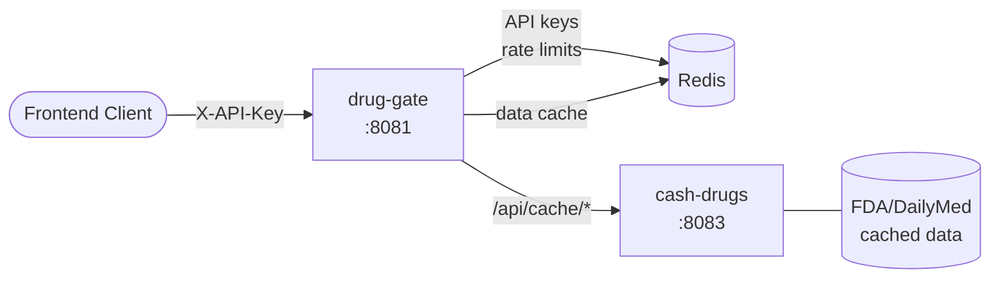
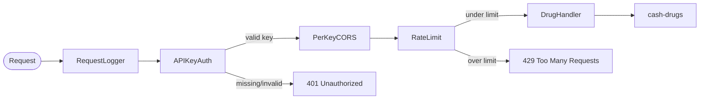
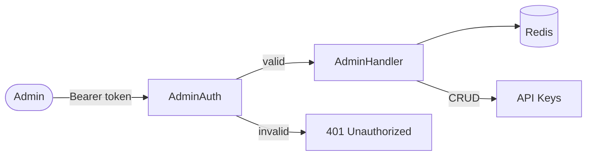
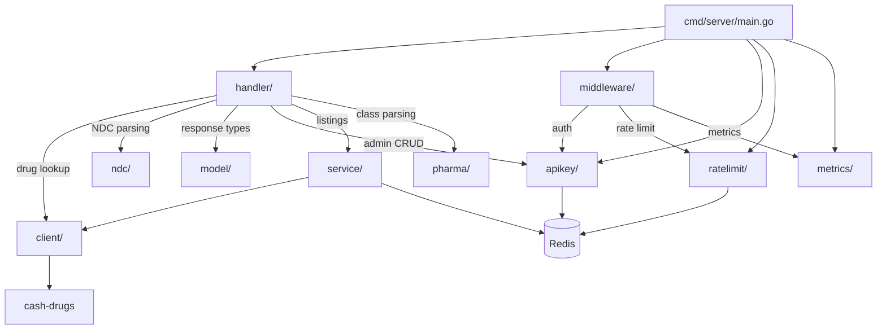

# drug-gate

Public-facing Go microservice gateway that provides frontend applications with drug information by querying the internal [cash-drugs](https://github.com/finish06/cash-drugs) API. Handles API key authentication, per-key rate limiting, CORS origin locking, NDC normalization, and data transformation.

## Features

- **NDC Lookup** — Look up drugs by National Drug Code with automatic format normalization (5-4, 4-4, 5-3) and fallback padding
- **Drug Class Lookup** — Look up therapeutic/pharmacological classes by drug name (generic or brand, with brand fallback)
- **Drug Names Listing** — Paginated, filterable list of ~104K drug names (generic/brand) with substring search
- **Drug Classes Listing** — Paginated, filterable list of drug classes by type (EPC, MoA, PE, CS)
- **Drugs by Class** — List drugs belonging to a specific pharmacological class
- **API Key Authentication** — Per-app API keys via `X-API-Key` header, stored in Redis
- **Per-Key Rate Limiting** — Sliding window rate limiter (Redis sorted sets) with configurable limits per key
- **CORS Origin Locking** — Per-key allowed origins list, or origin-free for server-to-server use
- **Admin API** — Create, list, get, deactivate, and rotate API keys via Bearer token auth
- **Key Rotation** — Rotate keys with a configurable grace period so old keys continue working during migration
- **Prometheus Metrics** — HTTP request metrics, cache hit/miss, auth/rate-limit rejections, Redis health, container system metrics (Linux)
- **OpenAPI/Swagger** — Interactive API docs at `/swagger/`

## Quick Start

### Docker Compose (recommended)

```bash
# Set your admin secret
export ADMIN_SECRET=your-secret-here

# Start drug-gate + Redis
docker-compose up
```

The API is available at `http://localhost:8081`.

### Local Development

```bash
# Build
make build

# Run (requires Redis on localhost:6379)
REDIS_URL=localhost:6379 ADMIN_SECRET=your-secret make run
```

## API Endpoints

### Public (no auth required)

| Method | Path | Description |
|--------|------|-------------|
| GET | `/health` | Health check with version |
| GET | `/metrics` | Prometheus metrics endpoint |
| GET | `/swagger/*` | Swagger UI |
| GET | `/openapi.json` | OpenAPI spec |

### Protected (requires `X-API-Key` header)

| Method | Path | Description |
|--------|------|-------------|
| GET | `/v1/drugs/ndc/{ndc}` | Look up drug by NDC code |
| GET | `/v1/drugs/class?name={name}` | Look up drug class by generic or brand name |
| GET | `/v1/drugs/names` | Paginated drug names (filter: `q`, `type`, `page`, `limit`) |
| GET | `/v1/drugs/classes` | Paginated drug classes (filter: `type`, `page`, `limit`) |
| GET | `/v1/drugs/classes/drugs?class={name}` | Drugs in a pharmacological class |

### Admin (requires `Authorization: Bearer <ADMIN_SECRET>`)

| Method | Path | Description |
|--------|------|-------------|
| POST | `/admin/keys` | Create a new API key |
| GET | `/admin/keys` | List all API keys |
| GET | `/admin/keys/{key}` | Get a single API key |
| DELETE | `/admin/keys/{key}` | Deactivate an API key |
| POST | `/admin/keys/{key}/rotate` | Rotate a key with grace period |

## Usage Examples

### Create an API key

```bash
curl -X POST http://localhost:8081/admin/keys \
  -H "Authorization: Bearer $ADMIN_SECRET" \
  -H "Content-Type: application/json" \
  -d '{"app_name": "my-frontend", "origins": ["https://myapp.com"], "rate_limit": 250}'
```

### Look up a drug by NDC

```bash
curl http://localhost:8081/v1/drugs/ndc/00069-3150 \
  -H "X-API-Key: pk_your_key_here"
```

Response:
```json
{
  "ndc": "00069-3150",
  "name": "Lipitor",
  "generic_name": "atorvastatin calcium",
  "classes": ["HMG-CoA Reductase Inhibitor"]
}
```

### Rotate a key

```bash
curl -X POST http://localhost:8081/admin/keys/pk_old_key/rotate \
  -H "Authorization: Bearer $ADMIN_SECRET" \
  -H "Content-Type: application/json" \
  -d '{"grace_period": "24h"}'
```

## Configuration

| Environment Variable | Default | Description |
|---------------------|---------|-------------|
| `LISTEN_ADDR` | `:8081` | Server listen address |
| `CASHDRUGS_URL` | `http://localhost:8083` | Upstream cash-drugs API URL |
| `REDIS_URL` | `redis:6379` | Redis connection address |
| `ADMIN_SECRET` | *(none)* | Bearer token for admin endpoints |
| `SYSTEM_METRICS_INTERVAL` | `15s` | System metrics collection interval (Linux only) |

## Architecture

### System Overview



### Request Flow (protected routes)



### Admin Flow



### Project Structure



## Development

```bash
make test-unit          # Run unit tests
make test-coverage      # Run tests with coverage report
make lint               # golangci-lint
make vet                # go vet
make build              # Build binary to bin/server

# Integration tests (requires running Redis)
go test -tags=integration ./...

# E2E tests (spins up full stack via docker-compose)
make test-e2e
```

## License

MIT
