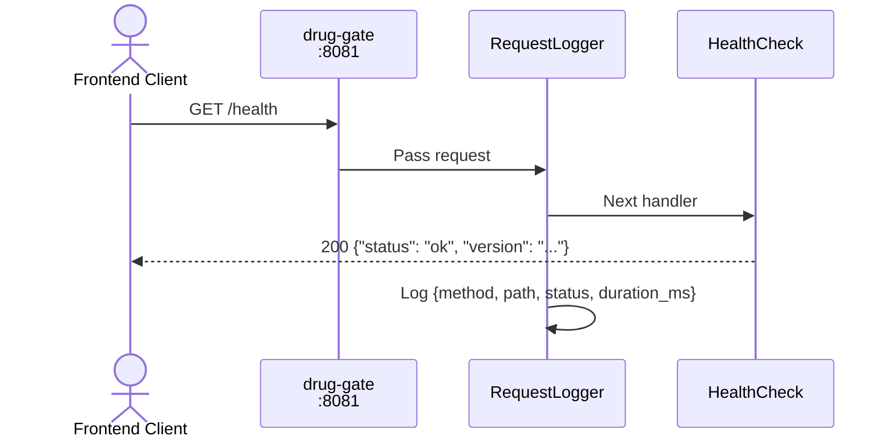
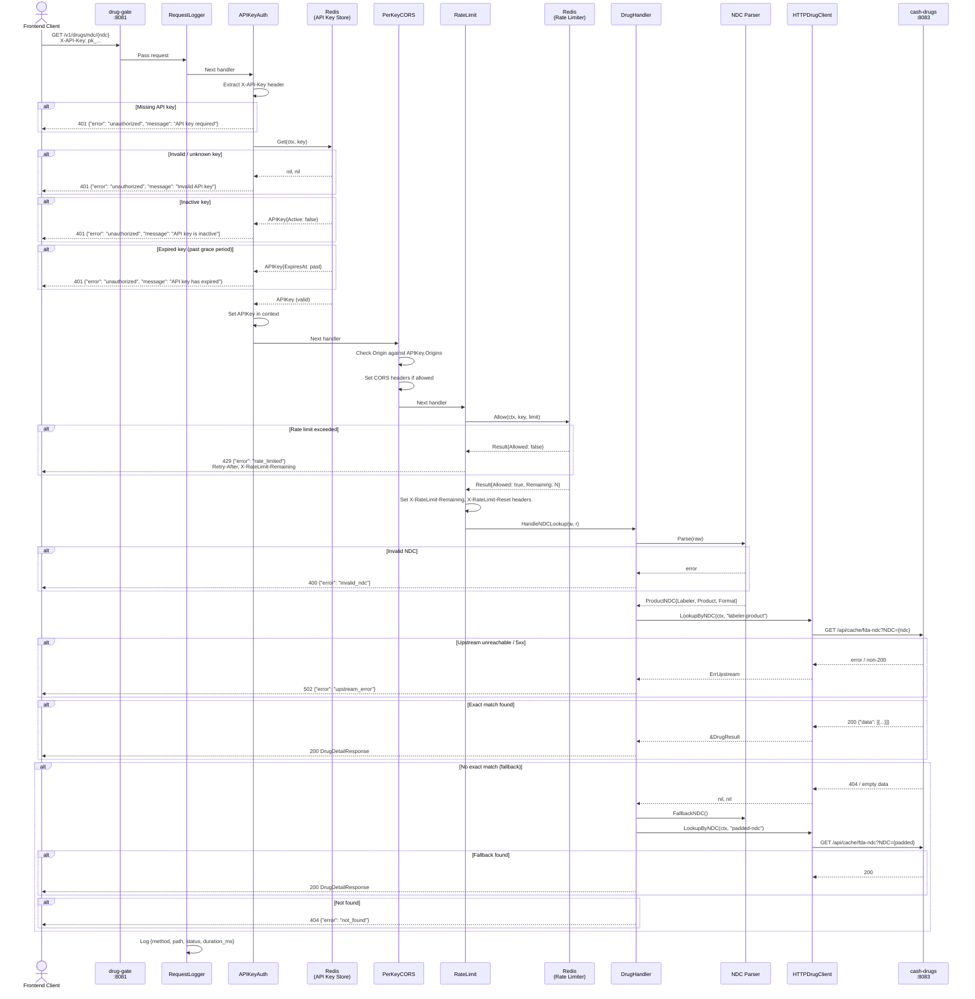
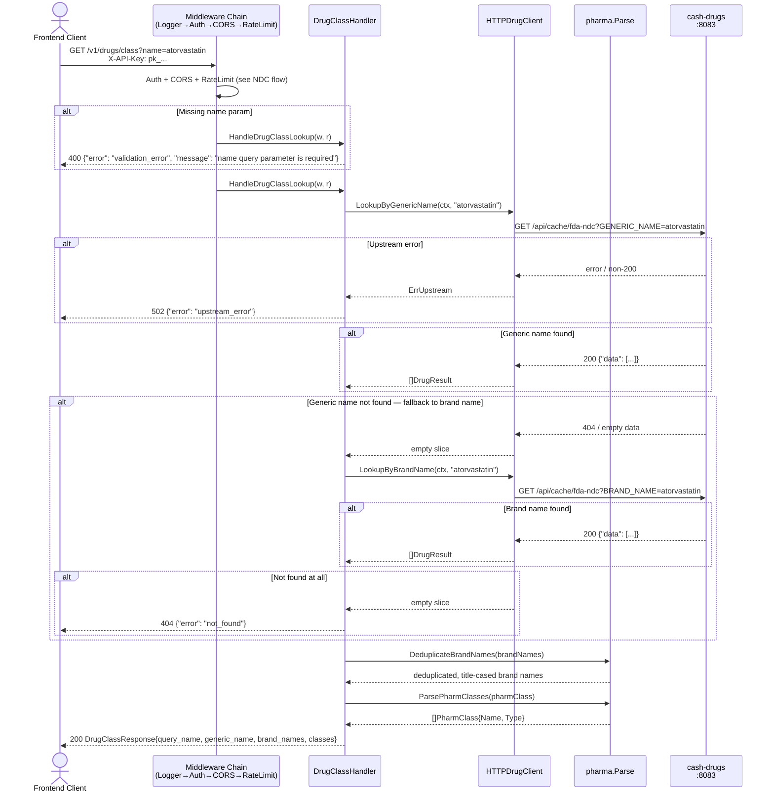
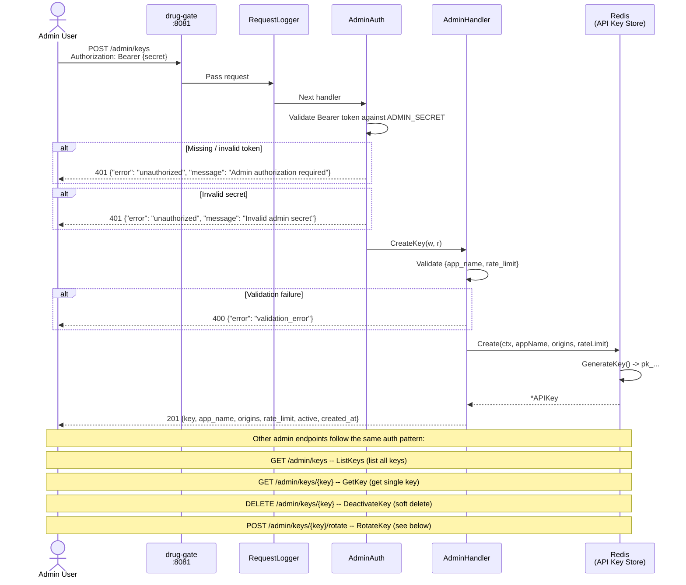
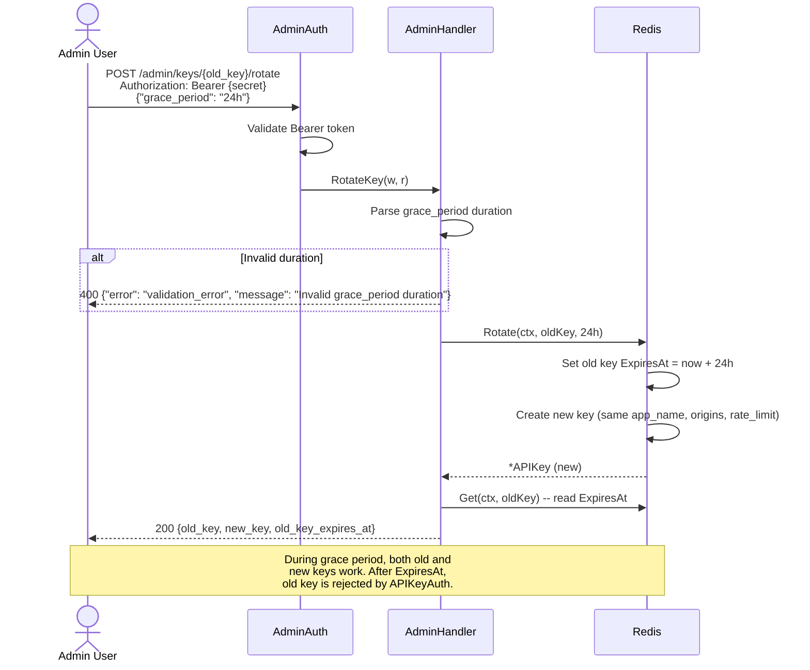
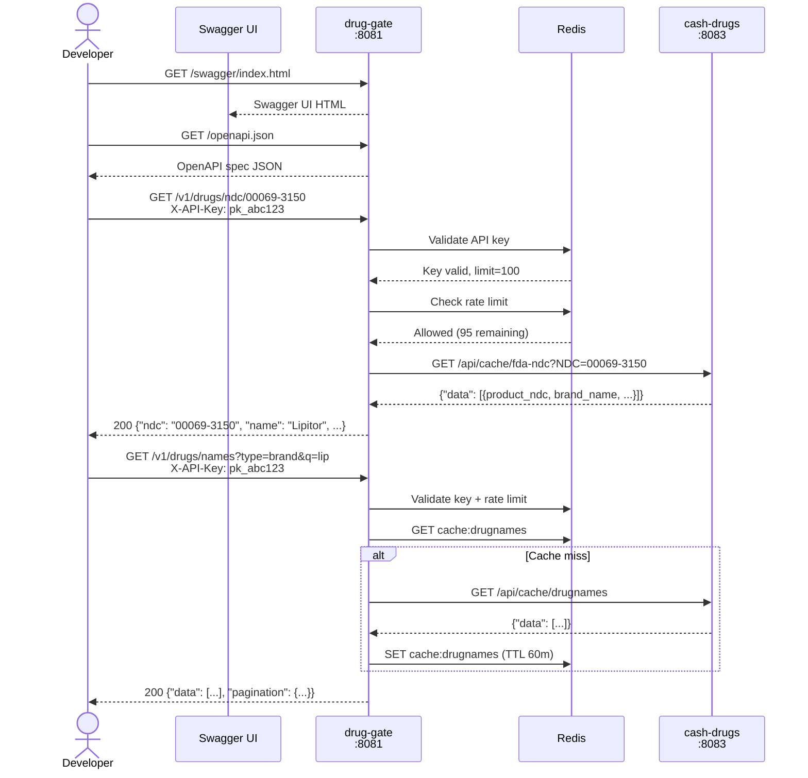

# drug-gate Sequence Diagrams

## Middleware Chain Overview

All `/v1/*` routes pass through the following middleware chain in order:

1. **RequestLogger** -- logs method, path, status, duration
2. **APIKeyAuth** -- validates X-API-Key header against Redis store
3. **PerKeyCORS** -- sets CORS headers based on the key's allowed origins
4. **RateLimit** -- enforces per-key rate limits via Redis sliding window

Admin `/admin/*` routes use a separate chain:

1. **RequestLogger** -- same global logger
2. **AdminAuth** -- validates Bearer token against ADMIN_SECRET env var

Public routes (`/health`, `/swagger/*`, `/openapi.json`) only pass through **RequestLogger**.

---

## Health Check



---

## NDC Drug Lookup (GET /v1/drugs/ndc/{ndc})



---

## Drug Class Lookup by Name (GET /v1/drugs/class?name=)



---

## Drug Names Listing (GET /v1/drugs/names)

```mermaid
sequenceDiagram
    actor Client as Frontend Client
    participant MW as Middleware Chain<br/>(Logger→Auth→CORS→RateLimit)
    participant DNH as DrugNamesHandler
    participant SVC as DrugDataService
    participant RDS as Redis<br/>(Data Cache)
    participant DC as HTTPDrugClient
    participant CD as cash-drugs<br/>:8083

    Client->>MW: GET /v1/drugs/names?type=brand&q=lipitor&page=1&limit=50<br/>X-API-Key: pk_...
    MW->>MW: Auth + CORS + RateLimit (see NDC flow)
    MW->>DNH: HandleDrugNames(w, r)

    DNH->>SVC: GetDrugNames(ctx)
    SVC->>RDS: GET cache:drugnames

    alt Cache hit
        RDS-->>SVC: cached JSON
        SVC->>RDS: EXPIRE cache:drugnames 60m (sliding TTL)
        SVC-->>DNH: []DrugNameEntry
    end

    alt Cache miss
        RDS-->>SVC: nil
        SVC->>DC: FetchDrugNames(ctx)
        DC->>CD: GET /api/cache/drugnames
        CD-->>DC: 200 {"data": [...]}
        DC-->>SVC: []DrugNameRaw
        SVC->>SVC: Transform name_type "B"→"brand", else→"generic"
        SVC->>RDS: SET cache:drugnames {json} EX 60m
        SVC-->>DNH: []DrugNameEntry
    end

    alt Upstream error (cache miss path)
        CD-->>DC: error / non-200
        DC-->>SVC: ErrUpstream
        SVC-->>DNH: ErrUpstream
        DNH-->>Client: 502 {"error": "upstream_error"}
    end

    DNH->>DNH: Filter by ?type= (brand/generic)
    DNH->>DNH: Filter by ?q= (substring search)
    DNH->>DNH: Paginate (page, limit; default 50, max 100)
    DNH-->>Client: 200 {"data": [...], "pagination": {page, limit, total, total_pages}}
```

---

## Drug Classes Listing (GET /v1/drugs/classes)

```mermaid
sequenceDiagram
    actor Client as Frontend Client
    participant MW as Middleware Chain<br/>(Logger→Auth→CORS→RateLimit)
    participant DCH as DrugClassesHandler
    participant SVC as DrugDataService
    participant RDS as Redis<br/>(Data Cache)
    participant DC as HTTPDrugClient
    participant CD as cash-drugs<br/>:8083

    Client->>MW: GET /v1/drugs/classes?type=epc&page=1&limit=50<br/>X-API-Key: pk_...
    MW->>MW: Auth + CORS + RateLimit (see NDC flow)
    MW->>DCH: HandleDrugClasses(w, r)

    DCH->>SVC: GetDrugClasses(ctx)
    SVC->>RDS: GET cache:drugclasses

    alt Cache hit
        RDS-->>SVC: cached JSON
        SVC->>RDS: EXPIRE cache:drugclasses 60m (sliding TTL)
        SVC-->>DCH: []DrugClassEntry
    end

    alt Cache miss
        RDS-->>SVC: nil
        SVC->>DC: FetchDrugClasses(ctx)
        DC->>CD: GET /api/cache/drugclasses
        CD-->>DC: 200 {"data": [...]}
        DC-->>SVC: []DrugClassRaw
        SVC->>SVC: Transform class_type to lowercase
        SVC->>RDS: SET cache:drugclasses {json} EX 60m
        SVC-->>DCH: []DrugClassEntry
    end

    alt Upstream error
        DC-->>SVC: ErrUpstream
        DCH-->>Client: 502 {"error": "upstream_error"}
    end

    DCH->>DCH: Filter by ?type= (default: "epc"; or "all")
    DCH->>DCH: Paginate (page, limit; default 50, max 100)
    DCH-->>Client: 200 {"data": [...], "pagination": {page, limit, total, total_pages}}
```

---

## Drugs by Class Listing (GET /v1/drugs/classes/drugs?class=)

```mermaid
sequenceDiagram
    actor Client as Frontend Client
    participant MW as Middleware Chain<br/>(Logger→Auth→CORS→RateLimit)
    participant DBH as DrugsByClassHandler
    participant SVC as DrugDataService
    participant RDS as Redis<br/>(Data Cache)
    participant DC as HTTPDrugClient
    participant CD as cash-drugs<br/>:8083

    Client->>MW: GET /v1/drugs/classes/drugs?class=Statin&page=1&limit=100<br/>X-API-Key: pk_...
    MW->>MW: Auth + CORS + RateLimit (see NDC flow)
    MW->>DBH: HandleDrugsByClass(w, r)

    alt Missing class param
        DBH-->>Client: 400 {"error": "validation_error", "message": "class query parameter is required"}
    end

    DBH->>SVC: GetDrugsByClass(ctx, "Statin")
    SVC->>RDS: GET cache:drugsbyclass:statin

    alt Cache hit
        RDS-->>SVC: cached JSON
        SVC->>RDS: EXPIRE cache:drugsbyclass:statin 60m (sliding TTL)
        SVC-->>DBH: []DrugInClassEntry
    end

    alt Cache miss
        RDS-->>SVC: nil
        SVC->>DC: LookupByPharmClass(ctx, "Statin")
        DC->>CD: GET /api/cache/fda-ndc?PHARM_CLASS=Statin
        CD-->>DC: 200 {"data": [...]}
        DC-->>SVC: []DrugResult
        SVC->>SVC: Transform to []DrugInClassEntry{generic_name, brand_name}
        SVC->>RDS: SET cache:drugsbyclass:statin {json} EX 60m
        SVC-->>DBH: []DrugInClassEntry
    end

    alt Upstream error
        DC-->>SVC: ErrUpstream
        DBH-->>Client: 502 {"error": "upstream_error"}
    end

    DBH->>DBH: Paginate (page, limit; default 100, max 500)
    DBH-->>Client: 200 {"data": [...], "pagination": {page, limit, total, total_pages}}
```

---

## Admin Key Management



---

## Key Rotation Flow



---

## System Overview



---

## Route Table

| Method | Path | Auth | Handler | Description |
|--------|------|------|---------|-------------|
| GET | `/health` | None | `HealthCheck` | Service health + version |
| GET | `/swagger/*` | None | `httpSwagger.WrapHandler` | Swagger UI |
| GET | `/openapi.json` | None | `OpenAPIJSON` | OpenAPI spec JSON |
| GET | `/v1/drugs/ndc/{ndc}` | API Key | `DrugHandler.HandleNDCLookup` | NDC drug lookup with fallback |
| GET | `/v1/drugs/class` | API Key | `DrugClassHandler.HandleDrugClassLookup` | Drug class lookup by name |
| GET | `/v1/drugs/names` | API Key | `DrugNamesHandler.HandleDrugNames` | Paginated drug names listing |
| GET | `/v1/drugs/classes` | API Key | `DrugClassesHandler.HandleDrugClasses` | Paginated drug classes listing |
| GET | `/v1/drugs/classes/drugs` | API Key | `DrugsByClassHandler.HandleDrugsByClass` | Paginated drugs-by-class listing |
| POST | `/admin/keys` | Admin Bearer | `AdminHandler.CreateKey` | Create API key |
| GET | `/admin/keys` | Admin Bearer | `AdminHandler.ListKeys` | List all API keys |
| GET | `/admin/keys/{key}` | Admin Bearer | `AdminHandler.GetKey` | Get single API key |
| DELETE | `/admin/keys/{key}` | Admin Bearer | `AdminHandler.DeactivateKey` | Deactivate API key |
| POST | `/admin/keys/{key}/rotate` | Admin Bearer | `AdminHandler.RotateKey` | Rotate API key with grace period |
