# drug-gate Sequence Diagrams

## Middleware Chain Overview

All routes pass through these global middleware (in order):

1. **RequestID** -- reads `X-Request-ID` header or generates UUID v4; sets response header and context
2. **RequestLogger** -- logs method, path, status, duration with request ID
3. **MetricsMiddleware** -- records `druggate_http_requests_total` and `druggate_http_request_duration_seconds` per route/method/status

`/v1/*` routes additionally pass through:

4. **APIKeyAuth** -- validates X-API-Key header against Redis store; increments `druggate_auth_rejections_total` on failure
5. **PerKeyCORS** -- sets CORS headers based on the key's allowed origins
6. **RateLimit** -- enforces per-key rate limits via Redis sliding window; increments `druggate_ratelimit_rejections_total` on 429

Admin `/admin/*` routes additionally pass through:

4. **AdminAuth** -- validates Bearer token against ADMIN_SECRET env var

Public routes (`/health`, `/version`, `/metrics`, `/swagger/*`, `/openapi.json`) use the global chain only (RequestID + RequestLogger + MetricsMiddleware).

---

## Health Check

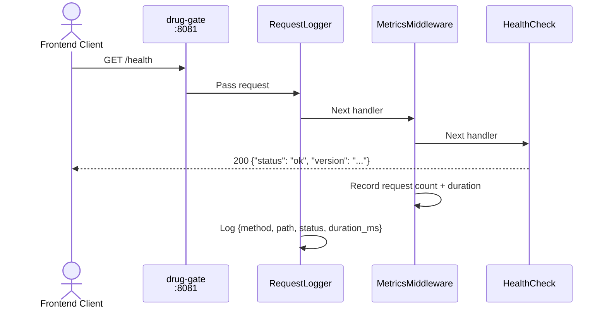
```mermaid
sequenceDiagram
    actor Client as Frontend Client
    participant GW as drug-gate<br/>:8081
    participant LOG as RequestLogger
    participant MET as MetricsMiddleware
    participant HC as HealthCheck

    Client->>GW: GET /health
    GW->>LOG: Pass request
    LOG->>MET: Next handler
    MET->>HC: Next handler
    HC-->>Client: 200 {"status": "ok", "version": "..."}
    MET->>MET: Record request count + duration
    LOG->>LOG: Log {method, path, status, duration_ms}
```

---

## Prometheus Metrics Scrape (GET /metrics)

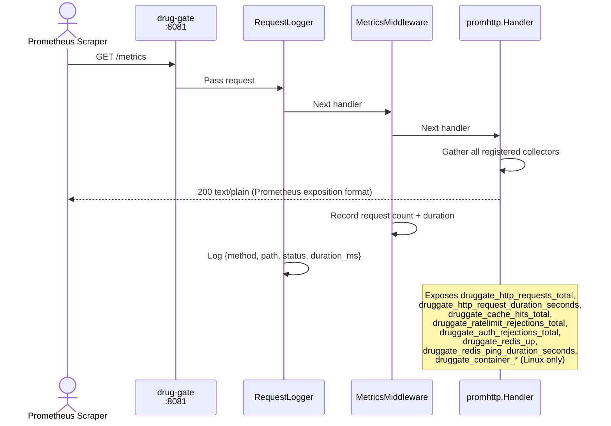
```mermaid
sequenceDiagram
    actor Prom as Prometheus Scraper
    participant GW as drug-gate<br/>:8081
    participant LOG as RequestLogger
    participant MET as MetricsMiddleware
    participant PH as promhttp.Handler

    Prom->>GW: GET /metrics
    GW->>LOG: Pass request
    LOG->>MET: Next handler
    MET->>PH: Next handler
    PH->>PH: Gather all registered collectors
    PH-->>Prom: 200 text/plain (Prometheus exposition format)
    MET->>MET: Record request count + duration
    LOG->>LOG: Log {method, path, status, duration_ms}

    Note over PH: Exposes druggate_http_requests_total,<br/>druggate_http_request_duration_seconds,<br/>druggate_cache_hits_total,<br/>druggate_ratelimit_rejections_total,<br/>druggate_auth_rejections_total,<br/>druggate_redis_up,<br/>druggate_redis_ping_duration_seconds,<br/>druggate_container_* (Linux only)
```

---

## Redis Health Collector (Background Loop)

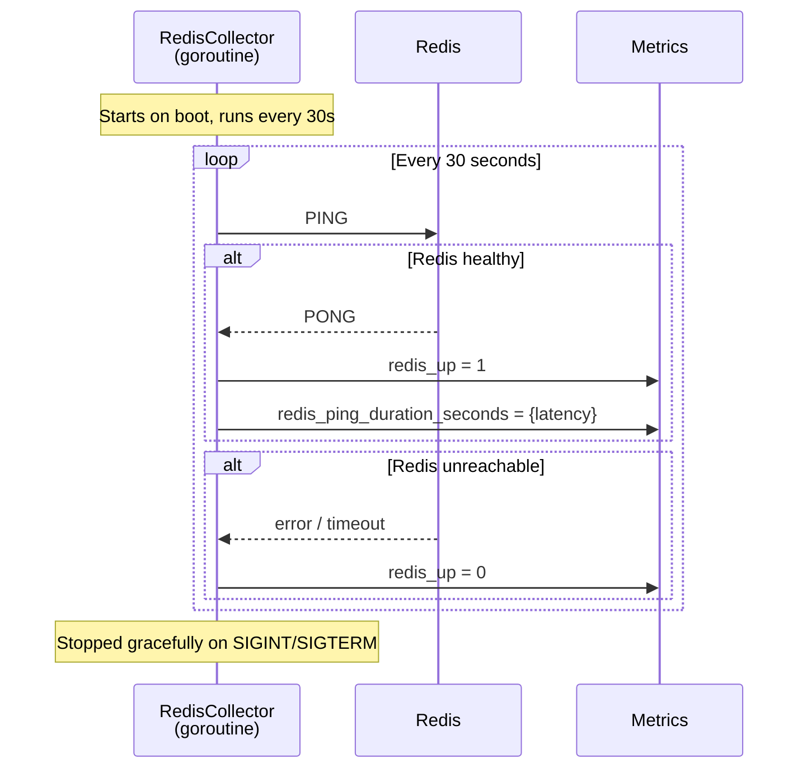
```mermaid
sequenceDiagram
    participant RC as RedisCollector<br/>(goroutine)
    participant RDS as Redis
    participant MET as Metrics

    Note over RC: Starts on boot, runs every 30s

    loop Every 30 seconds
        RC->>RDS: PING
        alt Redis healthy
            RDS-->>RC: PONG
            RC->>MET: redis_up = 1
            RC->>MET: redis_ping_duration_seconds = {latency}
        end
        alt Redis unreachable
            RDS-->>RC: error / timeout
            RC->>MET: redis_up = 0
        end
    end

    Note over RC: Stopped gracefully on SIGINT/SIGTERM
```

---

## System Metrics Collector (Background Loop, Linux Only)

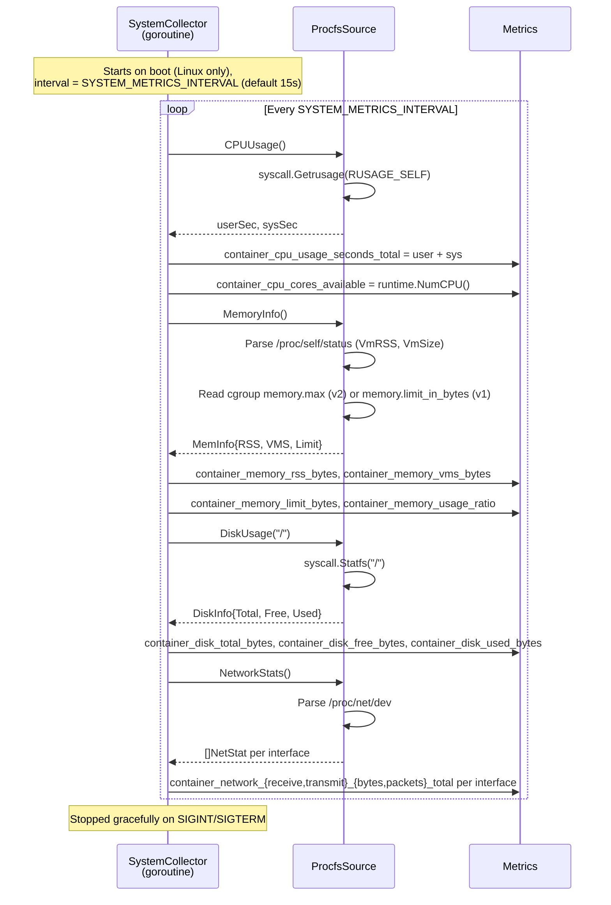
```mermaid
sequenceDiagram
    participant SC as SystemCollector<br/>(goroutine)
    participant PS as ProcfsSource
    participant MET as Metrics

    Note over SC: Starts on boot (Linux only),<br/>interval = SYSTEM_METRICS_INTERVAL (default 15s)

    loop Every SYSTEM_METRICS_INTERVAL
        SC->>PS: CPUUsage()
        PS->>PS: syscall.Getrusage(RUSAGE_SELF)
        PS-->>SC: userSec, sysSec
        SC->>MET: container_cpu_usage_seconds_total = user + sys
        SC->>MET: container_cpu_cores_available = runtime.NumCPU()

        SC->>PS: MemoryInfo()
        PS->>PS: Parse /proc/self/status (VmRSS, VmSize)
        PS->>PS: Read cgroup memory.max (v2) or memory.limit_in_bytes (v1)
        PS-->>SC: MemInfo{RSS, VMS, Limit}
        SC->>MET: container_memory_rss_bytes, container_memory_vms_bytes
        SC->>MET: container_memory_limit_bytes, container_memory_usage_ratio

        SC->>PS: DiskUsage("/")
        PS->>PS: syscall.Statfs("/")
        PS-->>SC: DiskInfo{Total, Free, Used}
        SC->>MET: container_disk_total_bytes, container_disk_free_bytes, container_disk_used_bytes

        SC->>PS: NetworkStats()
        PS->>PS: Parse /proc/net/dev
        PS-->>SC: []NetStat per interface
        SC->>MET: container_network_{receive,transmit}_{bytes,packets}_total per interface
    end

    Note over SC: Stopped gracefully on SIGINT/SIGTERM
```

---

## NDC Drug Lookup (GET /v1/drugs/ndc/{ndc})

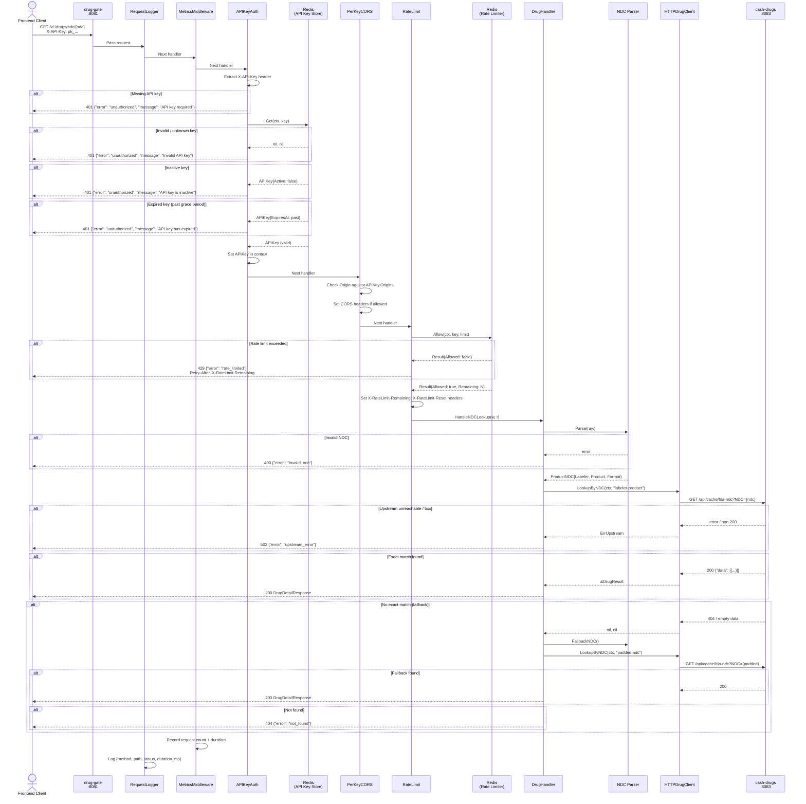
```mermaid
sequenceDiagram
    actor Client as Frontend Client
    participant GW as drug-gate<br/>:8081
    participant LOG as RequestLogger
    participant MET as MetricsMiddleware
    participant AUTH as APIKeyAuth
    participant RDS as Redis<br/>(API Key Store)
    participant CORS as PerKeyCORS
    participant RL as RateLimit
    participant RDL as Redis<br/>(Rate Limiter)
    participant DH as DrugHandler
    participant NDC as NDC Parser
    participant DC as HTTPDrugClient
    participant CD as cash-drugs<br/>:8083

    Client->>GW: GET /v1/drugs/ndc/{ndc}<br/>X-API-Key: pk_...
    GW->>LOG: Pass request
    LOG->>MET: Next handler
    MET->>AUTH: Next handler

    AUTH->>AUTH: Extract X-API-Key header

    alt Missing API key
        AUTH-->>Client: 401 {"error": "unauthorized", "message": "API key required"}
    end

    AUTH->>RDS: Get(ctx, key)

    alt Invalid / unknown key
        RDS-->>AUTH: nil, nil
        AUTH-->>Client: 401 {"error": "unauthorized", "message": "Invalid API key"}
    end

    alt Inactive key
        RDS-->>AUTH: APIKey{Active: false}
        AUTH-->>Client: 401 {"error": "unauthorized", "message": "API key is inactive"}
    end

    alt Expired key (past grace period)
        RDS-->>AUTH: APIKey{ExpiresAt: past}
        AUTH-->>Client: 401 {"error": "unauthorized", "message": "API key has expired"}
    end

    RDS-->>AUTH: APIKey (valid)
    AUTH->>AUTH: Set APIKey in context

    AUTH->>CORS: Next handler
    CORS->>CORS: Check Origin against APIKey.Origins
    CORS->>CORS: Set CORS headers if allowed

    CORS->>RL: Next handler
    RL->>RDL: Allow(ctx, key, limit)

    alt Rate limit exceeded
        RDL-->>RL: Result{Allowed: false}
        RL-->>Client: 429 {"error": "rate_limited"}<br/>Retry-After, X-RateLimit-Remaining
    end

    RDL-->>RL: Result{Allowed: true, Remaining: N}
    RL->>RL: Set X-RateLimit-Remaining, X-RateLimit-Reset headers

    RL->>DH: HandleNDCLookup(w, r)
    DH->>NDC: Parse(raw)

    alt Invalid NDC
        NDC-->>DH: error
        DH-->>Client: 400 {"error": "invalid_ndc"}
    end

    NDC-->>DH: ProductNDC{Labeler, Product, Format}

    DH->>DC: LookupByNDC(ctx, "labeler-product")
    DC->>CD: GET /api/cache/fda-ndc?NDC={ndc}

    alt Upstream unreachable / 5xx
        CD-->>DC: error / non-200
        DC-->>DH: ErrUpstream
        DH-->>Client: 502 {"error": "upstream_error"}
    end

    alt Exact match found
        CD-->>DC: 200 {"data": [{...}]}
        DC-->>DH: &DrugResult
        DH-->>Client: 200 DrugDetailResponse
    end

    alt No exact match (fallback)
        CD-->>DC: 404 / empty data
        DC-->>DH: nil, nil
        DH->>NDC: FallbackNDC()
        DH->>DC: LookupByNDC(ctx, "padded-ndc")
        DC->>CD: GET /api/cache/fda-ndc?NDC={padded}

        alt Fallback found
            CD-->>DC: 200
            DH-->>Client: 200 DrugDetailResponse
        end

        alt Not found
            DH-->>Client: 404 {"error": "not_found"}
        end
    end

    MET->>MET: Record request count + duration
    LOG->>LOG: Log {method, path, status, duration_ms}
```

---

## Drug Class Lookup by Name (GET /v1/drugs/class?name=)

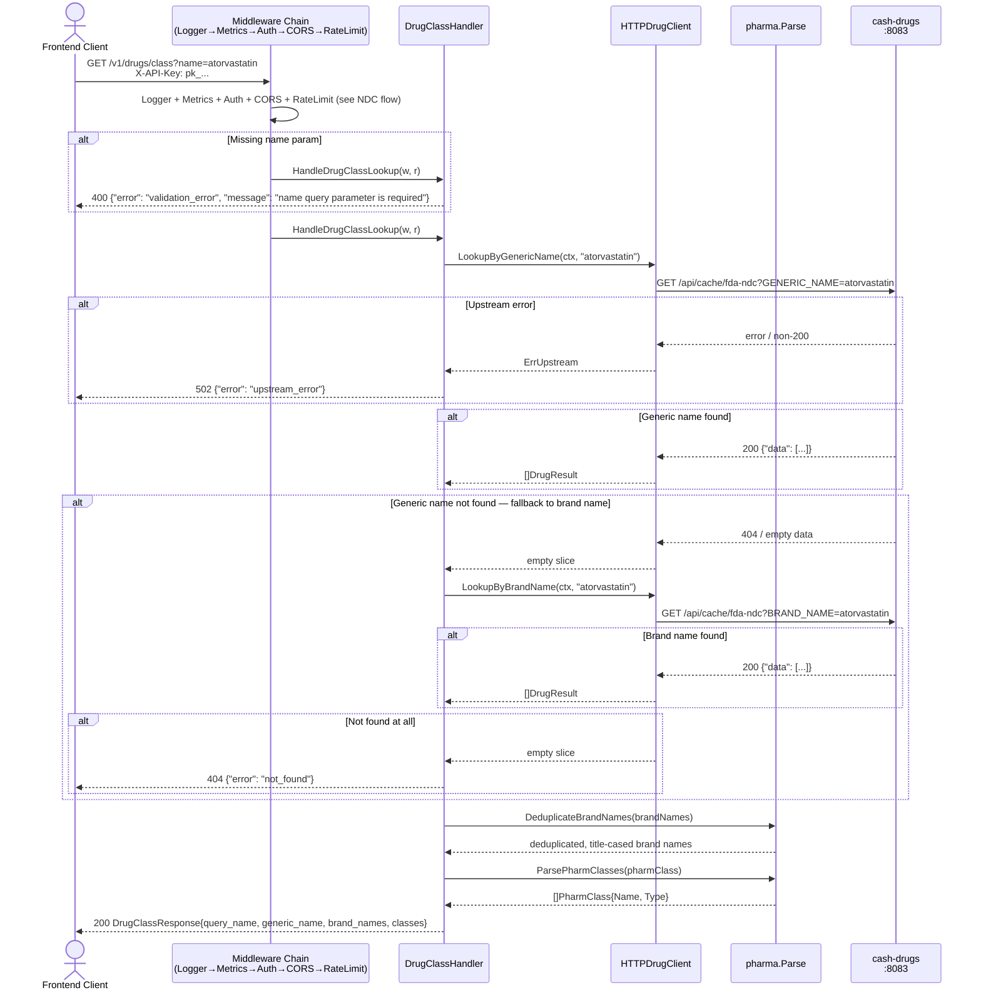
```mermaid
sequenceDiagram
    actor Client as Frontend Client
    participant MW as Middleware Chain<br/>(Logger→Metrics→Auth→CORS→RateLimit)
    participant DCH as DrugClassHandler
    participant DC as HTTPDrugClient
    participant PH as pharma.Parse
    participant CD as cash-drugs<br/>:8083

    Client->>MW: GET /v1/drugs/class?name=atorvastatin<br/>X-API-Key: pk_...
    MW->>MW: Logger + Metrics + Auth + CORS + RateLimit (see NDC flow)

    alt Missing name param
        MW->>DCH: HandleDrugClassLookup(w, r)
        DCH-->>Client: 400 {"error": "validation_error", "message": "name query parameter is required"}
    end

    MW->>DCH: HandleDrugClassLookup(w, r)

    DCH->>DC: LookupByGenericName(ctx, "atorvastatin")
    DC->>CD: GET /api/cache/fda-ndc?GENERIC_NAME=atorvastatin

    alt Upstream error
        CD-->>DC: error / non-200
        DC-->>DCH: ErrUpstream
        DCH-->>Client: 502 {"error": "upstream_error"}
    end

    alt Generic name found
        CD-->>DC: 200 {"data": [...]}
        DC-->>DCH: []DrugResult
    end

    alt Generic name not found — fallback to brand name
        CD-->>DC: 404 / empty data
        DC-->>DCH: empty slice
        DCH->>DC: LookupByBrandName(ctx, "atorvastatin")
        DC->>CD: GET /api/cache/fda-ndc?BRAND_NAME=atorvastatin

        alt Brand name found
            CD-->>DC: 200 {"data": [...]}
            DC-->>DCH: []DrugResult
        end

        alt Not found at all
            DC-->>DCH: empty slice
            DCH-->>Client: 404 {"error": "not_found"}
        end
    end

    DCH->>PH: DeduplicateBrandNames(brandNames)
    PH-->>DCH: deduplicated, title-cased brand names
    DCH->>PH: ParsePharmClasses(pharmClass)
    PH-->>DCH: []PharmClass{Name, Type}

    DCH-->>Client: 200 DrugClassResponse{query_name, generic_name, brand_names, classes}
```

---

## Drug Names Listing (GET /v1/drugs/names)

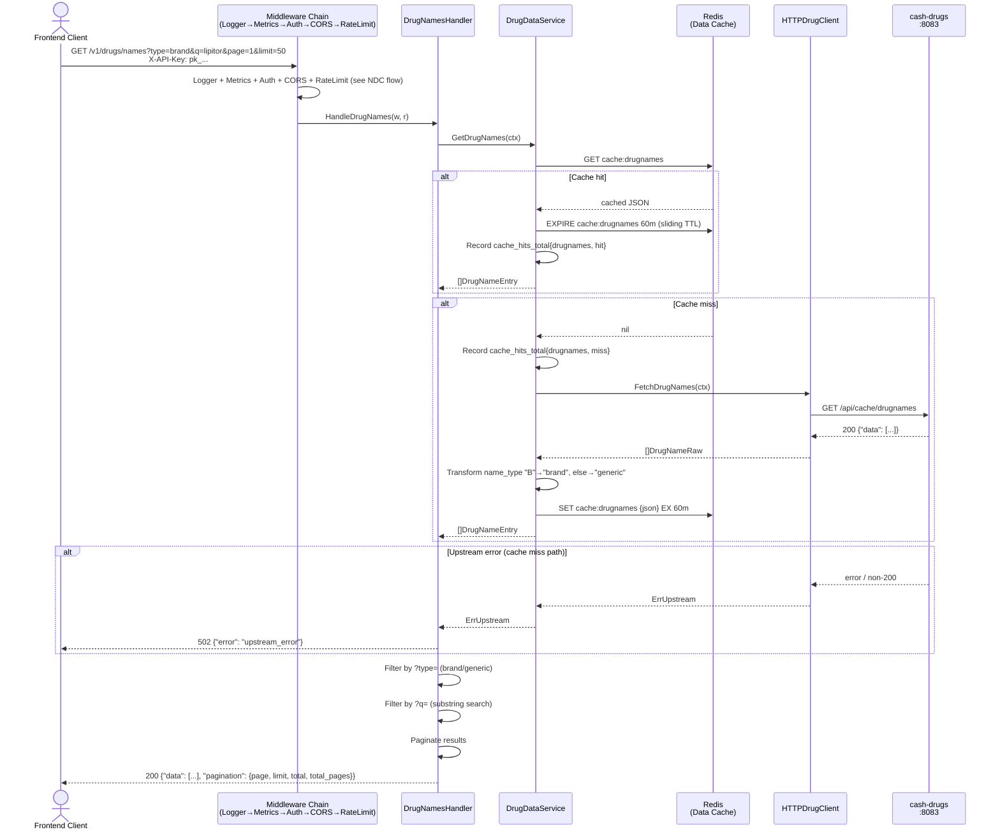
```mermaid
sequenceDiagram
    actor Client as Frontend Client
    participant MW as Middleware Chain<br/>(Logger→Metrics→Auth→CORS→RateLimit)
    participant DNH as DrugNamesHandler
    participant SVC as DrugDataService
    participant RDS as Redis<br/>(Data Cache)
    participant DC as HTTPDrugClient
    participant CD as cash-drugs<br/>:8083

    Client->>MW: GET /v1/drugs/names?type=brand&q=lipitor&page=1&limit=50<br/>X-API-Key: pk_...
    MW->>MW: Logger + Metrics + Auth + CORS + RateLimit (see NDC flow)
    MW->>DNH: HandleDrugNames(w, r)

    DNH->>SVC: GetDrugNames(ctx)
    SVC->>RDS: GET cache:drugnames

    alt Cache hit
        RDS-->>SVC: cached JSON
        SVC->>RDS: EXPIRE cache:drugnames 60m (sliding TTL)
        SVC->>SVC: Record cache_hits_total{drugnames, hit}
        SVC-->>DNH: []DrugNameEntry
    end

    alt Cache miss
        RDS-->>SVC: nil
        SVC->>SVC: Record cache_hits_total{drugnames, miss}
        SVC->>DC: FetchDrugNames(ctx)
        DC->>CD: GET /api/cache/drugnames
        CD-->>DC: 200 {"data": [...]}
        DC-->>SVC: []DrugNameRaw
        SVC->>SVC: Transform name_type "B"→"brand", else→"generic"
        SVC->>RDS: SET cache:drugnames {json} EX 60m
        SVC-->>DNH: []DrugNameEntry
    end

    alt Upstream error (cache miss path)
        CD-->>DC: error / non-200
        DC-->>SVC: ErrUpstream
        SVC-->>DNH: ErrUpstream
        DNH-->>Client: 502 {"error": "upstream_error"}
    end

    DNH->>DNH: Filter by ?type= (brand/generic)
    DNH->>DNH: Filter by ?q= (substring search)
    DNH->>DNH: Paginate results
    DNH-->>Client: 200 {"data": [...], "pagination": {page, limit, total, total_pages}}
```

---

## Drug Classes Listing (GET /v1/drugs/classes)

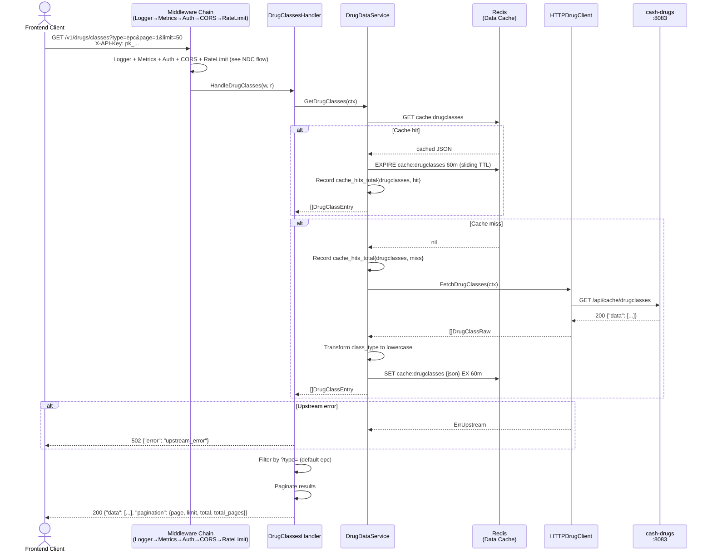
```mermaid
sequenceDiagram
    actor Client as Frontend Client
    participant MW as Middleware Chain<br/>(Logger→Metrics→Auth→CORS→RateLimit)
    participant DCH as DrugClassesHandler
    participant SVC as DrugDataService
    participant RDS as Redis<br/>(Data Cache)
    participant DC as HTTPDrugClient
    participant CD as cash-drugs<br/>:8083

    Client->>MW: GET /v1/drugs/classes?type=epc&page=1&limit=50<br/>X-API-Key: pk_...
    MW->>MW: Logger + Metrics + Auth + CORS + RateLimit (see NDC flow)
    MW->>DCH: HandleDrugClasses(w, r)

    DCH->>SVC: GetDrugClasses(ctx)
    SVC->>RDS: GET cache:drugclasses

    alt Cache hit
        RDS-->>SVC: cached JSON
        SVC->>RDS: EXPIRE cache:drugclasses 60m (sliding TTL)
        SVC->>SVC: Record cache_hits_total{drugclasses, hit}
        SVC-->>DCH: []DrugClassEntry
    end

    alt Cache miss
        RDS-->>SVC: nil
        SVC->>SVC: Record cache_hits_total{drugclasses, miss}
        SVC->>DC: FetchDrugClasses(ctx)
        DC->>CD: GET /api/cache/drugclasses
        CD-->>DC: 200 {"data": [...]}
        DC-->>SVC: []DrugClassRaw
        SVC->>SVC: Transform class_type to lowercase
        SVC->>RDS: SET cache:drugclasses {json} EX 60m
        SVC-->>DCH: []DrugClassEntry
    end

    alt Upstream error
        DC-->>SVC: ErrUpstream
        DCH-->>Client: 502 {"error": "upstream_error"}
    end

    DCH->>DCH: Filter by ?type= (default epc)
    DCH->>DCH: Paginate results
    DCH-->>Client: 200 {"data": [...], "pagination": {page, limit, total, total_pages}}
```

---

## Drugs by Class Listing (GET /v1/drugs/classes/drugs?class=)

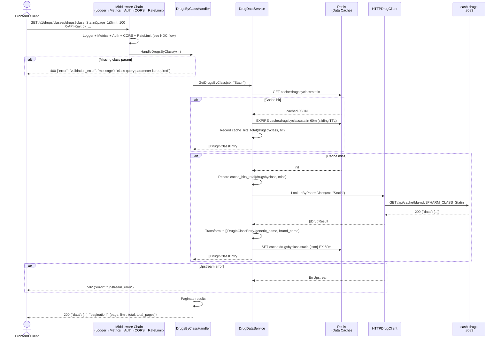
```mermaid
sequenceDiagram
    actor Client as Frontend Client
    participant MW as Middleware Chain<br/>(Logger→Metrics→Auth→CORS→RateLimit)
    participant DBH as DrugsByClassHandler
    participant SVC as DrugDataService
    participant RDS as Redis<br/>(Data Cache)
    participant DC as HTTPDrugClient
    participant CD as cash-drugs<br/>:8083

    Client->>MW: GET /v1/drugs/classes/drugs?class=Statin&page=1&limit=100<br/>X-API-Key: pk_...
    MW->>MW: Logger + Metrics + Auth + CORS + RateLimit (see NDC flow)
    MW->>DBH: HandleDrugsByClass(w, r)

    alt Missing class param
        DBH-->>Client: 400 {"error": "validation_error", "message": "class query parameter is required"}
    end

    DBH->>SVC: GetDrugsByClass(ctx, "Statin")
    SVC->>RDS: GET cache:drugsbyclass:statin

    alt Cache hit
        RDS-->>SVC: cached JSON
        SVC->>RDS: EXPIRE cache:drugsbyclass:statin 60m (sliding TTL)
        SVC->>SVC: Record cache_hits_total{drugsbyclass, hit}
        SVC-->>DBH: []DrugInClassEntry
    end

    alt Cache miss
        RDS-->>SVC: nil
        SVC->>SVC: Record cache_hits_total{drugsbyclass, miss}
        SVC->>DC: LookupByPharmClass(ctx, "Statin")
        DC->>CD: GET /api/cache/fda-ndc?PHARM_CLASS=Statin
        CD-->>DC: 200 {"data": [...]}
        DC-->>SVC: []DrugResult
        SVC->>SVC: Transform to []DrugInClassEntry{generic_name, brand_name}
        SVC->>RDS: SET cache:drugsbyclass:statin {json} EX 60m
        SVC-->>DBH: []DrugInClassEntry
    end

    alt Upstream error
        DC-->>SVC: ErrUpstream
        DBH-->>Client: 502 {"error": "upstream_error"}
    end

    DBH->>DBH: Paginate results
    DBH-->>Client: 200 {"data": [...], "pagination": {page, limit, total, total_pages}}
```

---

## Admin Key Management

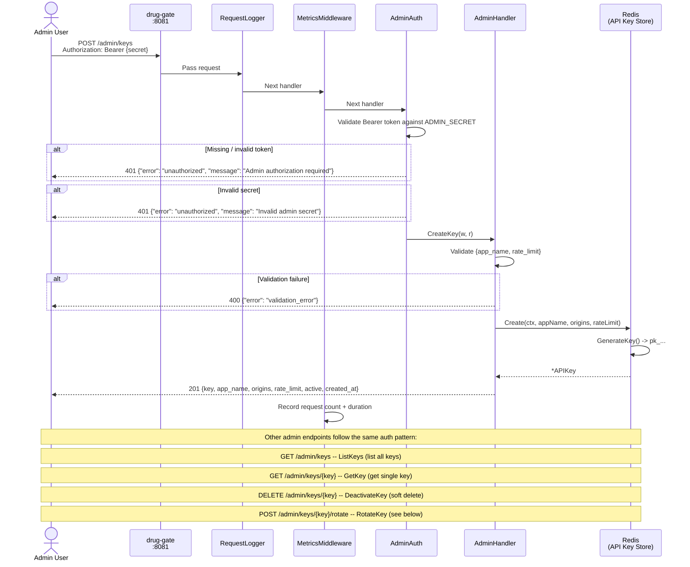
```mermaid
sequenceDiagram
    actor Admin as Admin User
    participant GW as drug-gate<br/>:8081
    participant LOG as RequestLogger
    participant MET as MetricsMiddleware
    participant ADM as AdminAuth
    participant AH as AdminHandler
    participant RDS as Redis<br/>(API Key Store)

    Admin->>GW: POST /admin/keys<br/>Authorization: Bearer {secret}
    GW->>LOG: Pass request
    LOG->>MET: Next handler
    MET->>ADM: Next handler
    ADM->>ADM: Validate Bearer token against ADMIN_SECRET

    alt Missing / invalid token
        ADM-->>Admin: 401 {"error": "unauthorized", "message": "Admin authorization required"}
    end

    alt Invalid secret
        ADM-->>Admin: 401 {"error": "unauthorized", "message": "Invalid admin secret"}
    end

    ADM->>AH: CreateKey(w, r)
    AH->>AH: Validate {app_name, rate_limit}

    alt Validation failure
        AH-->>Admin: 400 {"error": "validation_error"}
    end

    AH->>RDS: Create(ctx, appName, origins, rateLimit)
    RDS->>RDS: GenerateKey() -> pk_...
    RDS-->>AH: *APIKey
    AH-->>Admin: 201 {key, app_name, origins, rate_limit, active, created_at}

    MET->>MET: Record request count + duration

    Note over Admin, RDS: Other admin endpoints follow the same auth pattern:
    Note over Admin, RDS: GET /admin/keys -- ListKeys (list all keys)
    Note over Admin, RDS: GET /admin/keys/{key} -- GetKey (get single key)
    Note over Admin, RDS: DELETE /admin/keys/{key} -- DeactivateKey (soft delete)
    Note over Admin, RDS: POST /admin/keys/{key}/rotate -- RotateKey (see below)
```

---

## Key Rotation Flow

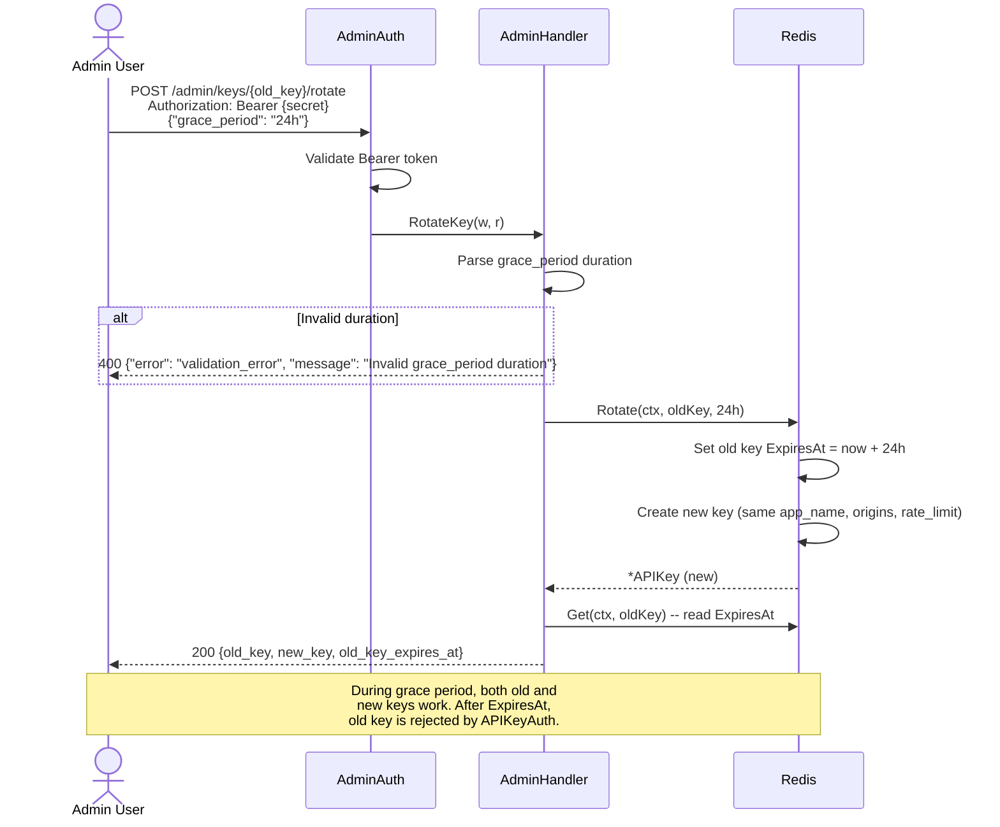
```mermaid
sequenceDiagram
    actor Admin as Admin User
    participant ADM as AdminAuth
    participant AH as AdminHandler
    participant RDS as Redis

    Admin->>ADM: POST /admin/keys/{old_key}/rotate<br/>Authorization: Bearer {secret}<br/>{"grace_period": "24h"}
    ADM->>ADM: Validate Bearer token
    ADM->>AH: RotateKey(w, r)
    AH->>AH: Parse grace_period duration

    alt Invalid duration
        AH-->>Admin: 400 {"error": "validation_error", "message": "Invalid grace_period duration"}
    end

    AH->>RDS: Rotate(ctx, oldKey, 24h)
    RDS->>RDS: Set old key ExpiresAt = now + 24h
    RDS->>RDS: Create new key (same app_name, origins, rate_limit)
    RDS-->>AH: *APIKey (new)
    AH->>RDS: Get(ctx, oldKey) -- read ExpiresAt
    AH-->>Admin: 200 {old_key, new_key, old_key_expires_at}

    Note over Admin, RDS: During grace period, both old and<br/>new keys work. After ExpiresAt,<br/>old key is rejected by APIKeyAuth.
```

---

## System Overview

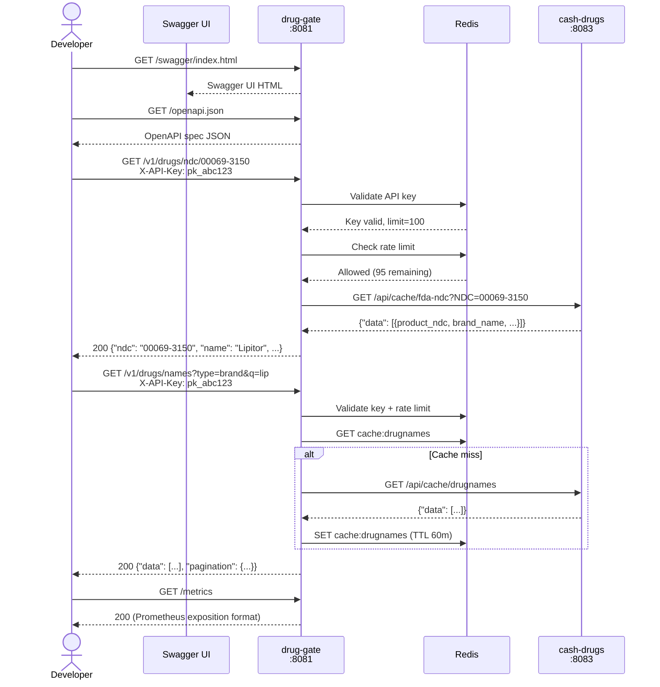
```mermaid
sequenceDiagram
    actor Dev as Developer
    participant SW as Swagger UI
    participant GW as drug-gate<br/>:8081
    participant RD as Redis
    participant CD as cash-drugs<br/>:8083

    Dev->>GW: GET /swagger/index.html
    GW-->>SW: Swagger UI HTML
    Dev->>GW: GET /openapi.json
    GW-->>Dev: OpenAPI spec JSON

    Dev->>GW: GET /v1/drugs/ndc/00069-3150<br/>X-API-Key: pk_abc123
    GW->>RD: Validate API key
    RD-->>GW: Key valid, limit=100
    GW->>RD: Check rate limit
    RD-->>GW: Allowed (95 remaining)
    GW->>CD: GET /api/cache/fda-ndc?NDC=00069-3150
    CD-->>GW: {"data": [{product_ndc, brand_name, ...}]}
    GW-->>Dev: 200 {"ndc": "00069-3150", "name": "Lipitor", ...}

    Dev->>GW: GET /v1/drugs/names?type=brand&q=lip<br/>X-API-Key: pk_abc123
    GW->>RD: Validate key + rate limit
    GW->>RD: GET cache:drugnames
    alt Cache miss
        GW->>CD: GET /api/cache/drugnames
        CD-->>GW: {"data": [...]}
        GW->>RD: SET cache:drugnames (TTL 60m)
    end
    GW-->>Dev: 200 {"data": [...], "pagination": {...}}

    Dev->>GW: GET /metrics
    GW-->>Dev: 200 (Prometheus exposition format)
```

---

## RxNorm Drug Search (GET /v1/drugs/rxnorm/search?name=)

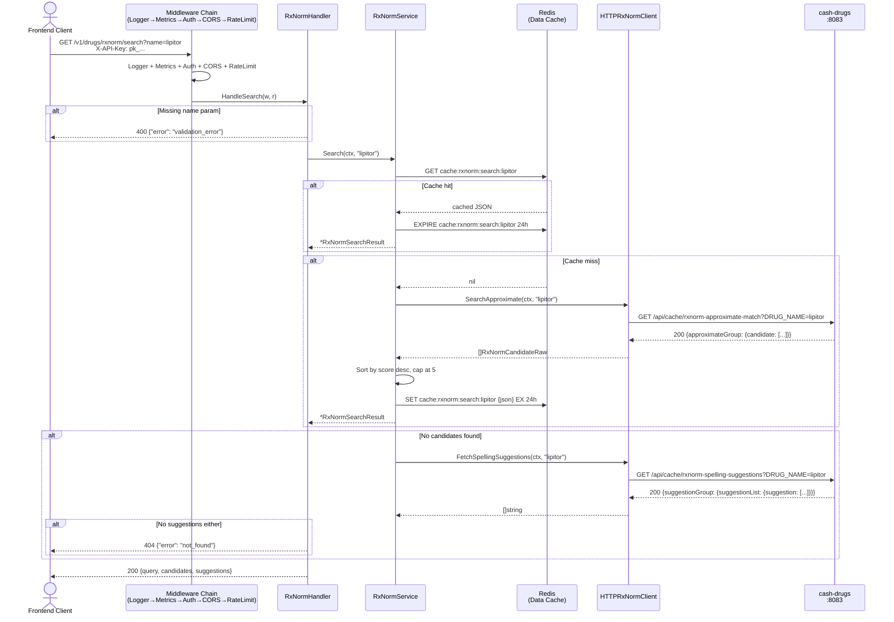
```mermaid
sequenceDiagram
    actor Client as Frontend Client
    participant MW as Middleware Chain<br/>(Logger→Metrics→Auth→CORS→RateLimit)
    participant RSH as RxNormHandler
    participant SVC as RxNormService
    participant RDS as Redis<br/>(Data Cache)
    participant RC as HTTPRxNormClient
    participant CD as cash-drugs<br/>:8083

    Client->>MW: GET /v1/drugs/rxnorm/search?name=lipitor<br/>X-API-Key: pk_...
    MW->>MW: Logger + Metrics + Auth + CORS + RateLimit
    MW->>RSH: HandleSearch(w, r)

    alt Missing name param
        RSH-->>Client: 400 {"error": "validation_error"}
    end

    RSH->>SVC: Search(ctx, "lipitor")
    SVC->>RDS: GET cache:rxnorm:search:lipitor

    alt Cache hit
        RDS-->>SVC: cached JSON
        SVC->>RDS: EXPIRE cache:rxnorm:search:lipitor 24h
        SVC-->>RSH: *RxNormSearchResult
    end

    alt Cache miss
        RDS-->>SVC: nil
        SVC->>RC: SearchApproximate(ctx, "lipitor")
        RC->>CD: GET /api/cache/rxnorm-approximate-match?DRUG_NAME=lipitor
        CD-->>RC: 200 {approximateGroup: {candidate: [...]}}
        RC-->>SVC: []RxNormCandidateRaw
        SVC->>SVC: Sort by score desc, cap at 5
        SVC->>RDS: SET cache:rxnorm:search:lipitor {json} EX 24h
        SVC-->>RSH: *RxNormSearchResult
    end

    alt No candidates found
        SVC->>RC: FetchSpellingSuggestions(ctx, "lipitor")
        RC->>CD: GET /api/cache/rxnorm-spelling-suggestions?DRUG_NAME=lipitor
        CD-->>RC: 200 {suggestionGroup: {suggestionList: {suggestion: [...]}}}
        RC-->>SVC: []string

        alt No suggestions either
            RSH-->>Client: 404 {"error": "not_found"}
        end
    end

    RSH-->>Client: 200 {query, candidates, suggestions}
```

---

## RxNorm Drug Profile (GET /v1/drugs/rxnorm/profile?name=)

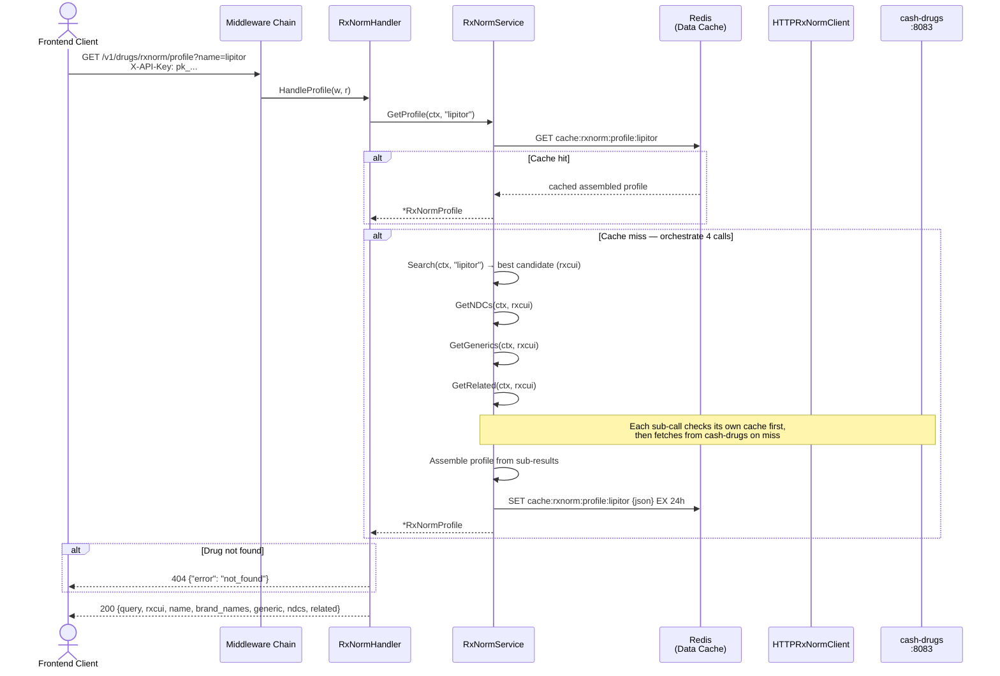
```mermaid
sequenceDiagram
    actor Client as Frontend Client
    participant MW as Middleware Chain
    participant RSH as RxNormHandler
    participant SVC as RxNormService
    participant RDS as Redis<br/>(Data Cache)
    participant RC as HTTPRxNormClient
    participant CD as cash-drugs<br/>:8083

    Client->>MW: GET /v1/drugs/rxnorm/profile?name=lipitor<br/>X-API-Key: pk_...
    MW->>RSH: HandleProfile(w, r)

    RSH->>SVC: GetProfile(ctx, "lipitor")
    SVC->>RDS: GET cache:rxnorm:profile:lipitor

    alt Cache hit
        RDS-->>SVC: cached assembled profile
        SVC-->>RSH: *RxNormProfile
    end

    alt Cache miss — orchestrate 4 calls
        SVC->>SVC: Search(ctx, "lipitor") → best candidate (rxcui)
        SVC->>SVC: GetNDCs(ctx, rxcui)
        SVC->>SVC: GetGenerics(ctx, rxcui)
        SVC->>SVC: GetRelated(ctx, rxcui)

        Note over SVC,CD: Each sub-call checks its own cache first,<br/>then fetches from cash-drugs on miss

        SVC->>SVC: Assemble profile from sub-results
        SVC->>RDS: SET cache:rxnorm:profile:lipitor {json} EX 24h
        SVC-->>RSH: *RxNormProfile
    end

    alt Drug not found
        RSH-->>Client: 404 {"error": "not_found"}
    end

    RSH-->>Client: 200 {query, rxcui, name, brand_names, generic, ndcs, related}
```

---

## RxNorm Granular Lookups (NDCs / Generics / Related)

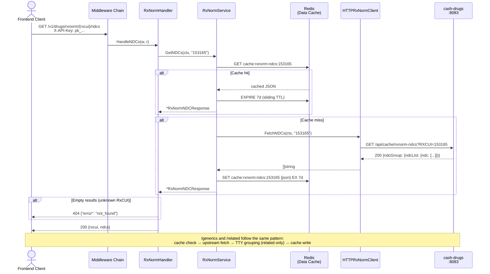
```mermaid
sequenceDiagram
    actor Client as Frontend Client
    participant MW as Middleware Chain
    participant RSH as RxNormHandler
    participant SVC as RxNormService
    participant RDS as Redis<br/>(Data Cache)
    participant RC as HTTPRxNormClient
    participant CD as cash-drugs<br/>:8083

    Client->>MW: GET /v1/drugs/rxnorm/{rxcui}/ndcs<br/>X-API-Key: pk_...
    MW->>RSH: HandleNDCs(w, r)

    RSH->>SVC: GetNDCs(ctx, "153165")
    SVC->>RDS: GET cache:rxnorm:ndcs:153165

    alt Cache hit
        RDS-->>SVC: cached JSON
        SVC->>RDS: EXPIRE 7d (sliding TTL)
        SVC-->>RSH: *RxNormNDCResponse
    end

    alt Cache miss
        SVC->>RC: FetchNDCs(ctx, "153165")
        RC->>CD: GET /api/cache/rxnorm-ndcs?RXCUI=153165
        CD-->>RC: 200 {ndcGroup: {ndcList: {ndc: [...]}}}
        RC-->>SVC: []string
        SVC->>RDS: SET cache:rxnorm:ndcs:153165 {json} EX 7d
        SVC-->>RSH: *RxNormNDCResponse
    end

    alt Empty results (unknown RxCUI)
        RSH-->>Client: 404 {"error": "not_found"}
    end

    RSH-->>Client: 200 {rxcui, ndcs}

    Note over Client,CD: /generics and /related follow the same pattern:<br/>cache check → upstream fetch → TTY grouping (related only) → cache write
```

---

## Drug Autocomplete (GET /v1/drugs/autocomplete?q=)

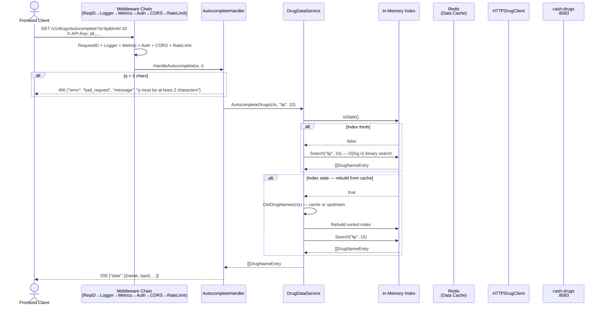
```mermaid
sequenceDiagram
    actor Client as Frontend Client
    participant MW as Middleware Chain<br/>(ReqID→Logger→Metrics→Auth→CORS→RateLimit)
    participant ACH as AutocompleteHandler
    participant SVC as DrugDataService
    participant IDX as In-Memory Index
    participant RDS as Redis<br/>(Data Cache)
    participant DC as HTTPDrugClient
    participant CD as cash-drugs<br/>:8083

    Client->>MW: GET /v1/drugs/autocomplete?q=lip&limit=10<br/>X-API-Key: pk_...
    MW->>MW: RequestID + Logger + Metrics + Auth + CORS + RateLimit
    MW->>ACH: HandleAutocomplete(w, r)

    alt q < 2 chars
        ACH-->>Client: 400 {"error": "bad_request", "message": "q must be at least 2 characters"}
    end

    ACH->>SVC: AutocompleteDrugs(ctx, "lip", 10)
    SVC->>IDX: isStale()

    alt Index fresh
        IDX-->>SVC: false
        SVC->>IDX: Search("lip", 10) — O(log n) binary search
        IDX-->>SVC: []DrugNameEntry
    end

    alt Index stale — rebuild from cache
        IDX-->>SVC: true
        SVC->>SVC: GetDrugNames(ctx) — cache or upstream
        SVC->>IDX: Rebuild sorted index
        SVC->>IDX: Search("lip", 10)
        IDX-->>SVC: []DrugNameEntry
    end

    SVC-->>ACH: []DrugNameEntry
    ACH-->>Client: 200 {"data": [{name, type}, ...]}
```

---

## SPL Search (GET /v1/drugs/spls?name=)

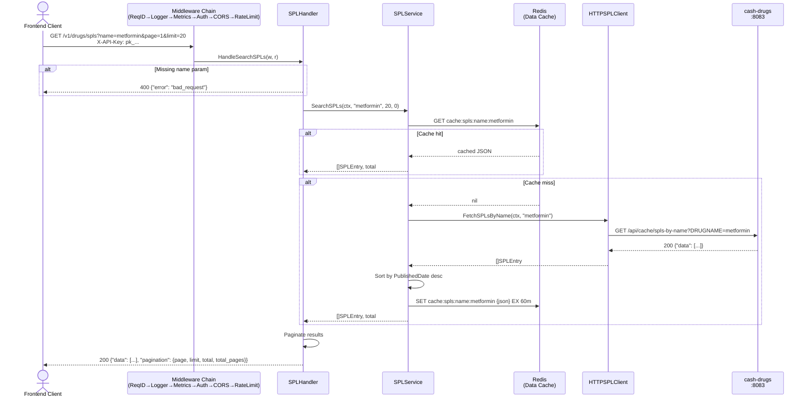
```mermaid
sequenceDiagram
    actor Client as Frontend Client
    participant MW as Middleware Chain<br/>(ReqID→Logger→Metrics→Auth→CORS→RateLimit)
    participant SH as SPLHandler
    participant SVC as SPLService
    participant RDS as Redis<br/>(Data Cache)
    participant SC as HTTPSPLClient
    participant CD as cash-drugs<br/>:8083

    Client->>MW: GET /v1/drugs/spls?name=metformin&page=1&limit=20<br/>X-API-Key: pk_...
    MW->>SH: HandleSearchSPLs(w, r)

    alt Missing name param
        SH-->>Client: 400 {"error": "bad_request"}
    end

    SH->>SVC: SearchSPLs(ctx, "metformin", 20, 0)
    SVC->>RDS: GET cache:spls:name:metformin

    alt Cache hit
        RDS-->>SVC: cached JSON
        SVC-->>SH: []SPLEntry, total
    end

    alt Cache miss
        RDS-->>SVC: nil
        SVC->>SC: FetchSPLsByName(ctx, "metformin")
        SC->>CD: GET /api/cache/spls-by-name?DRUGNAME=metformin
        CD-->>SC: 200 {"data": [...]}
        SC-->>SVC: []SPLEntry
        SVC->>SVC: Sort by PublishedDate desc
        SVC->>RDS: SET cache:spls:name:metformin {json} EX 60m
        SVC-->>SH: []SPLEntry, total
    end

    SH->>SH: Paginate results
    SH-->>Client: 200 {"data": [...], "pagination": {page, limit, total, total_pages}}
```

---

## SPL Detail with Interactions (GET /v1/drugs/spls/{setid})

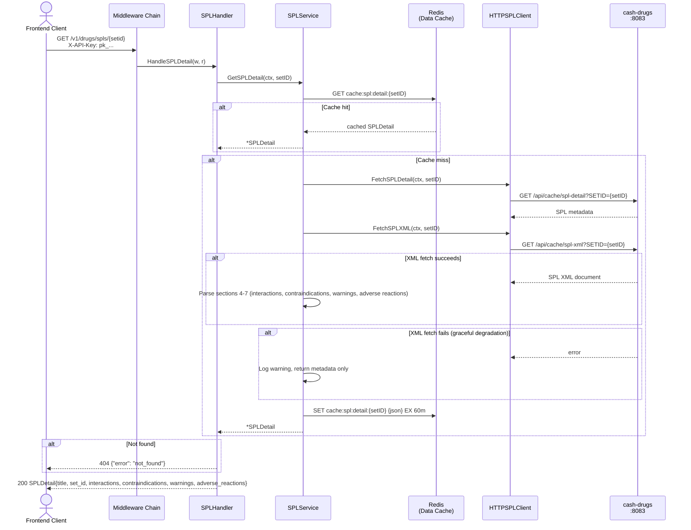
```mermaid
sequenceDiagram
    actor Client as Frontend Client
    participant MW as Middleware Chain
    participant SH as SPLHandler
    participant SVC as SPLService
    participant RDS as Redis<br/>(Data Cache)
    participant SC as HTTPSPLClient
    participant CD as cash-drugs<br/>:8083

    Client->>MW: GET /v1/drugs/spls/{setid}<br/>X-API-Key: pk_...
    MW->>SH: HandleSPLDetail(w, r)

    SH->>SVC: GetSPLDetail(ctx, setID)
    SVC->>RDS: GET cache:spl:detail:{setID}

    alt Cache hit
        RDS-->>SVC: cached SPLDetail
        SVC-->>SH: *SPLDetail
    end

    alt Cache miss
        SVC->>SC: FetchSPLDetail(ctx, setID)
        SC->>CD: GET /api/cache/spl-detail?SETID={setID}
        CD-->>SC: SPL metadata
        SVC->>SC: FetchSPLXML(ctx, setID)
        SC->>CD: GET /api/cache/spl-xml?SETID={setID}

        alt XML fetch succeeds
            CD-->>SC: SPL XML document
            SVC->>SVC: Parse sections 4-7 (interactions, contraindications, warnings, adverse reactions)
        end

        alt XML fetch fails (graceful degradation)
            CD-->>SC: error
            SVC->>SVC: Log warning, return metadata only
        end

        SVC->>RDS: SET cache:spl:detail:{setID} {json} EX 60m
        SVC-->>SH: *SPLDetail
    end

    alt Not found
        SH-->>Client: 404 {"error": "not_found"}
    end

    SH-->>Client: 200 SPLDetail{title, set_id, interactions, contraindications, warnings, adverse_reactions}
```

---

## Drug Info Card (GET /v1/drugs/info?name= or ?ndc=)

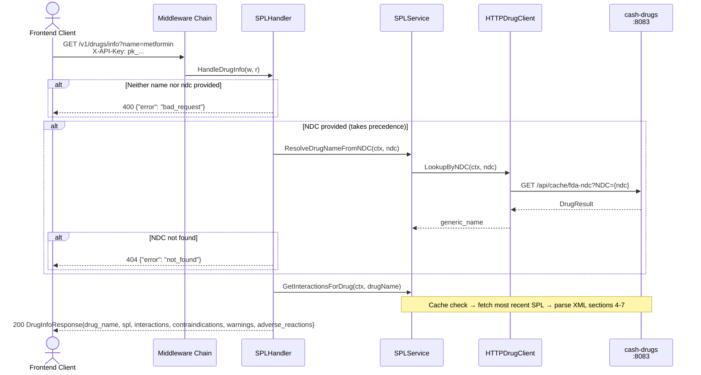
```mermaid
sequenceDiagram
    actor Client as Frontend Client
    participant MW as Middleware Chain
    participant SH as SPLHandler
    participant SVC as SPLService
    participant DC as HTTPDrugClient
    participant CD as cash-drugs<br/>:8083

    Client->>MW: GET /v1/drugs/info?name=metformin<br/>X-API-Key: pk_...
    MW->>SH: HandleDrugInfo(w, r)

    alt Neither name nor ndc provided
        SH-->>Client: 400 {"error": "bad_request"}
    end

    alt NDC provided (takes precedence)
        SH->>SVC: ResolveDrugNameFromNDC(ctx, ndc)
        SVC->>DC: LookupByNDC(ctx, ndc)
        DC->>CD: GET /api/cache/fda-ndc?NDC={ndc}
        CD-->>DC: DrugResult
        DC-->>SVC: generic_name
        alt NDC not found
            SH-->>Client: 404 {"error": "not_found"}
        end
    end

    SH->>SVC: GetInteractionsForDrug(ctx, drugName)
    Note over SVC,CD: Cache check → fetch most recent SPL → parse XML sections 4-7

    SH-->>Client: 200 DrugInfoResponse{drug_name, spl, interactions, contraindications, warnings, adverse_reactions}
```

---

## Drug Interaction Checker (POST /v1/drugs/interactions)

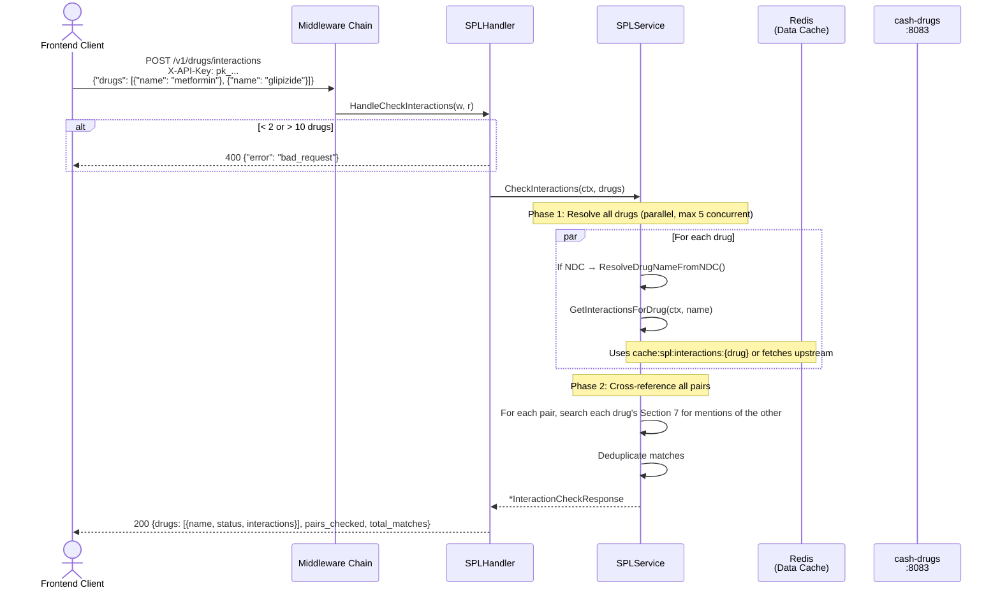
```mermaid
sequenceDiagram
    actor Client as Frontend Client
    participant MW as Middleware Chain
    participant SH as SPLHandler
    participant SVC as SPLService
    participant RDS as Redis<br/>(Data Cache)
    participant CD as cash-drugs<br/>:8083

    Client->>MW: POST /v1/drugs/interactions<br/>X-API-Key: pk_...<br/>{"drugs": [{"name": "metformin"}, {"name": "glipizide"}]}
    MW->>SH: HandleCheckInteractions(w, r)

    alt < 2 or > 10 drugs
        SH-->>Client: 400 {"error": "bad_request"}
    end

    SH->>SVC: CheckInteractions(ctx, drugs)

    Note over SVC: Phase 1: Resolve all drugs (parallel, max 5 concurrent)

    par For each drug
        SVC->>SVC: If NDC → ResolveDrugNameFromNDC()
        SVC->>SVC: GetInteractionsForDrug(ctx, name)
        Note over SVC,RDS: Uses cache:spl:interactions:{drug} or fetches upstream
    end

    Note over SVC: Phase 2: Cross-reference all pairs

    SVC->>SVC: For each pair, search each drug's Section 7 for mentions of the other
    SVC->>SVC: Deduplicate matches

    SVC-->>SH: *InteractionCheckResponse
    SH-->>Client: 200 {drugs: [{name, status, interactions}], pairs_checked, total_matches}
```

---

## SPL Background Indexer (Startup Process)

```mermaid
sequenceDiagram
    participant IDX as SPL Indexer<br/>(goroutine)
    participant RDS as Redis
    participant SC as HTTPSPLClient
    participant CD as cash-drugs<br/>:8083

    Note over IDX: Starts on boot, runs once then on configurable interval

    IDX->>RDS: GET cache:drugnames
    RDS-->>IDX: []DrugNameEntry (or nil)

    alt No drug names cached
        Note over IDX: Skip indexing, wait for next interval
    end

    loop For each drug name (up to maxDrugs=200)
        IDX->>RDS: GET cache:spl:interactions:{drug}

        alt Already cached
            Note over IDX: Skip (already indexed)
        end

        alt Not cached
            IDX->>SC: FetchSPLsByName(ctx, drug)
            SC->>CD: GET /api/cache/spls-by-name?DRUGNAME={drug}
            IDX->>SC: FetchSPLXML(ctx, setID)
            SC->>CD: GET /api/cache/spl-xml?SETID={setID}
            IDX->>IDX: ParseInteractions(xml)
            IDX->>RDS: SET cache:spl:interactions:{drug} EX IndexerCacheTTL
        end
    end

    Note over IDX: Stopped gracefully on SIGINT/SIGTERM
```

---

## Route Table

| Method | Path | Auth | Handler | Description |
|--------|------|------|---------|-------------|
| GET | `/health` | None | `HealthCheck` | Service health + version |
| GET | `/version` | None | `VersionInfo` | Build version, git commit, branch, Go version |
| GET | `/metrics` | None | `promhttp.Handler` | Prometheus metrics endpoint |
| GET | `/swagger/*` | None | `httpSwagger.WrapHandler` | Swagger UI |
| GET | `/openapi.json` | None | `OpenAPIJSON` | OpenAPI spec JSON |
| GET | `/v1/drugs/ndc/{ndc}` | API Key | `DrugHandler.HandleNDCLookup` | NDC drug lookup with fallback |
| GET | `/v1/drugs/class` | API Key | `DrugClassHandler.HandleDrugClassLookup` | Drug class lookup by name |
| GET | `/v1/drugs/names` | API Key | `DrugNamesHandler.HandleDrugNames` | Paginated drug names listing |
| GET | `/v1/drugs/classes` | API Key | `DrugClassesHandler.HandleDrugClasses` | Paginated drug classes listing |
| GET | `/v1/drugs/classes/drugs` | API Key | `DrugsByClassHandler.HandleDrugsByClass` | Paginated drugs-by-class listing |
| GET | `/v1/drugs/autocomplete` | API Key | `AutocompleteHandler.HandleAutocomplete` | Prefix search typeahead (in-memory index) |
| GET | `/v1/drugs/spls` | API Key | `SPLHandler.HandleSearchSPLs` | Search SPL documents by drug name |
| GET | `/v1/drugs/spls/{setid}` | API Key | `SPLHandler.HandleSPLDetail` | SPL detail with parsed interaction sections |
| GET | `/v1/drugs/info` | API Key | `SPLHandler.HandleDrugInfo` | Drug info card (by name or NDC) |
| POST | `/v1/drugs/interactions` | API Key | `SPLHandler.HandleCheckInteractions` | Cross-reference drug interactions (2-10 drugs) |
| GET | `/v1/drugs/rxnorm/search` | API Key | `RxNormHandler.HandleSearch` | RxNorm fuzzy drug search |
| GET | `/v1/drugs/rxnorm/profile` | API Key | `RxNormHandler.HandleProfile` | Unified drug profile |
| GET | `/v1/drugs/rxnorm/{rxcui}/ndcs` | API Key | `RxNormHandler.HandleNDCs` | NDCs for an RxCUI |
| GET | `/v1/drugs/rxnorm/{rxcui}/generics` | API Key | `RxNormHandler.HandleGenerics` | Generic equivalents |
| GET | `/v1/drugs/rxnorm/{rxcui}/related` | API Key | `RxNormHandler.HandleRelated` | Related concepts by type |
| POST | `/admin/keys` | Admin Bearer | `AdminHandler.CreateKey` | Create API key |
| GET | `/admin/keys` | Admin Bearer | `AdminHandler.ListKeys` | List all API keys |
| GET | `/admin/keys/{key}` | Admin Bearer | `AdminHandler.GetKey` | Get single API key |
| DELETE | `/admin/keys/{key}` | Admin Bearer | `AdminHandler.DeactivateKey` | Deactivate API key |
| POST | `/admin/keys/{key}/rotate` | Admin Bearer | `AdminHandler.RotateKey` | Rotate API key with grace period |
| DELETE | `/admin/cache` | Admin Bearer | `CacheHandler.ClearCache` | Clear Redis cache (all or by prefix) |

---

## Metrics Reference

### HTTP Metrics (via MetricsMiddleware)
| Metric | Type | Labels | Description |
|--------|------|--------|-------------|
| `druggate_http_requests_total` | Counter | route, method, status_code | Total HTTP requests |
| `druggate_http_request_duration_seconds` | Histogram | route, method | Request latency |

### Cache Metrics (via DrugDataService)
| Metric | Type | Labels | Description |
|--------|------|--------|-------------|
| `druggate_cache_hits_total` | Counter | key_type, outcome | Redis cache hit/miss by key type |

### Auth & Rate Limit Metrics
| Metric | Type | Labels | Description |
|--------|------|--------|-------------|
| `druggate_auth_rejections_total` | Counter | reason | Auth failures by reason |
| `druggate_ratelimit_rejections_total` | Counter | api_key | Rate limit 429s by key |

### Redis Health Metrics (via RedisCollector, every 30s)
| Metric | Type | Description |
|--------|------|-------------|
| `druggate_redis_up` | Gauge | Redis health (1=healthy, 0=unhealthy) |
| `druggate_redis_ping_duration_seconds` | Gauge | Last Redis ping latency |

### Container System Metrics (via SystemCollector, Linux only, every 15s default)
| Metric | Type | Labels | Description |
|--------|------|--------|-------------|
| `druggate_container_cpu_usage_seconds_total` | Gauge | | Total CPU time consumed |
| `druggate_container_cpu_cores_available` | Gauge | | Available CPU cores |
| `druggate_container_memory_rss_bytes` | Gauge | | Resident set size |
| `druggate_container_memory_vms_bytes` | Gauge | | Virtual memory size |
| `druggate_container_memory_limit_bytes` | Gauge | | Memory limit (-1 if unlimited) |
| `druggate_container_memory_usage_ratio` | Gauge | | RSS / limit ratio |
| `druggate_container_disk_total_bytes` | Gauge | | Total disk space |
| `druggate_container_disk_free_bytes` | Gauge | | Free disk space |
| `druggate_container_disk_used_bytes` | Gauge | | Used disk space |
| `druggate_container_network_receive_bytes_total` | Gauge | interface | Bytes received per NIC |
| `druggate_container_network_transmit_bytes_total` | Gauge | interface | Bytes transmitted per NIC |
| `druggate_container_network_receive_packets_total` | Gauge | interface | Packets received per NIC |
| `druggate_container_network_transmit_packets_total` | Gauge | interface | Packets transmitted per NIC |
