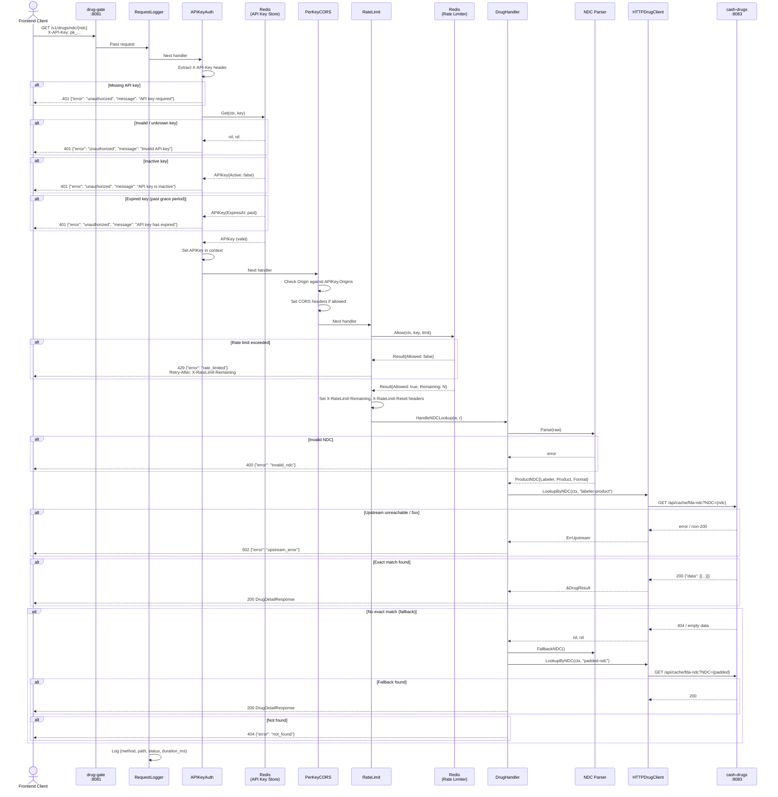
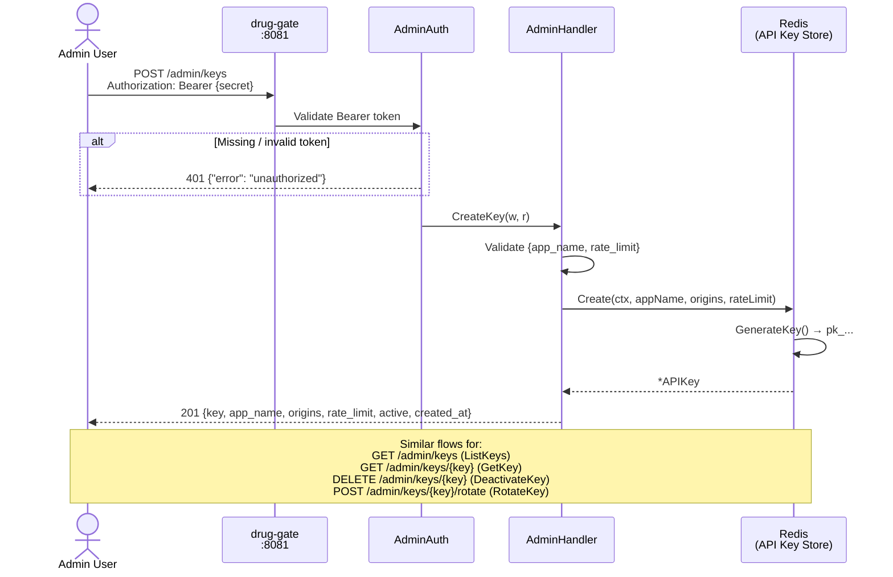
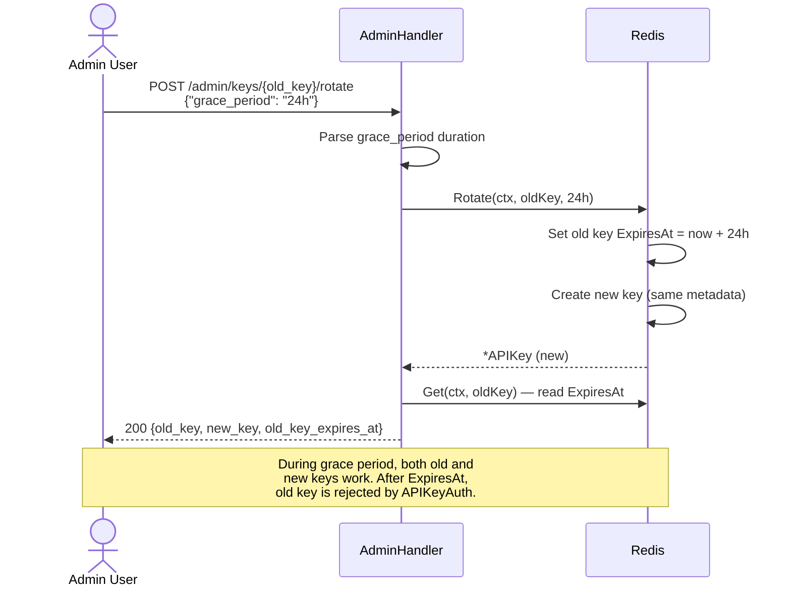
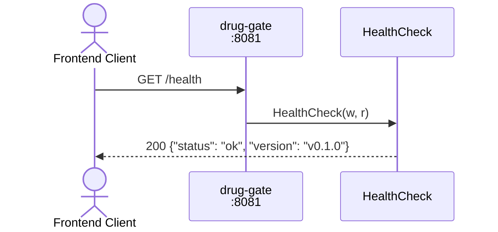
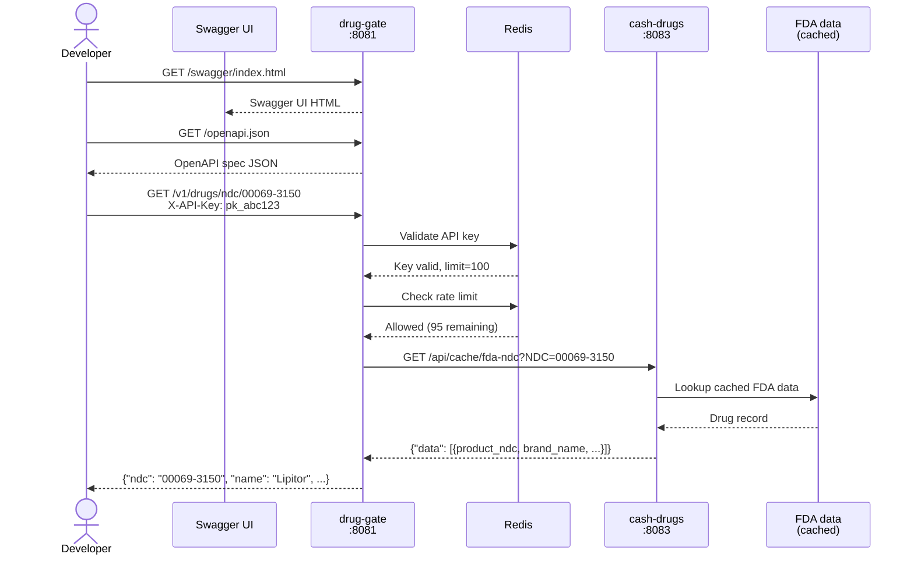

# drug-gate Sequence Diagram

## Authenticated NDC Lookup Flow

```mermaid
sequenceDiagram
    actor Client as Frontend Client
    participant GW as drug-gate<br/>:8081
    participant LOG as RequestLogger
    participant AUTH as APIKeyAuth
    participant RDS as Redis<br/>(API Key Store)
    participant CORS as PerKeyCORS
    participant RL as RateLimit
    participant RDL as Redis<br/>(Rate Limiter)
    participant DH as DrugHandler
    participant NDC as NDC Parser
    participant DC as HTTPDrugClient
    participant CD as cash-drugs<br/>:8083

    Client->>GW: GET /v1/drugs/ndc/{ndc}<br/>X-API-Key: pk_...
    GW->>LOG: Pass request
    LOG->>AUTH: Next handler

    AUTH->>AUTH: Extract X-API-Key header

    alt Missing API key
        AUTH-->>Client: 401 {"error": "unauthorized", "message": "API key required"}
    end

    AUTH->>RDS: Get(ctx, key)

    alt Invalid / unknown key
        RDS-->>AUTH: nil, nil
        AUTH-->>Client: 401 {"error": "unauthorized", "message": "Invalid API key"}
    end

    alt Inactive key
        RDS-->>AUTH: APIKey{Active: false}
        AUTH-->>Client: 401 {"error": "unauthorized", "message": "API key is inactive"}
    end

    alt Expired key (past grace period)
        RDS-->>AUTH: APIKey{ExpiresAt: past}
        AUTH-->>Client: 401 {"error": "unauthorized", "message": "API key has expired"}
    end

    RDS-->>AUTH: APIKey (valid)
    AUTH->>AUTH: Set APIKey in context

    AUTH->>CORS: Next handler
    CORS->>CORS: Check Origin against APIKey.Origins
    CORS->>CORS: Set CORS headers if allowed

    CORS->>RL: Next handler
    RL->>RDL: Allow(ctx, key, limit)

    alt Rate limit exceeded
        RDL-->>RL: Result{Allowed: false}
        RL-->>Client: 429 {"error": "rate_limited"}<br/>Retry-After, X-RateLimit-Remaining
    end

    RDL-->>RL: Result{Allowed: true, Remaining: N}
    RL->>RL: Set X-RateLimit-Remaining, X-RateLimit-Reset headers

    RL->>DH: HandleNDCLookup(w, r)
    DH->>NDC: Parse(raw)

    alt Invalid NDC
        NDC-->>DH: error
        DH-->>Client: 400 {"error": "invalid_ndc"}
    end

    NDC-->>DH: ProductNDC{Labeler, Product, Format}

    DH->>DC: LookupByNDC(ctx, "labeler-product")
    DC->>CD: GET /api/cache/fda-ndc?NDC={ndc}

    alt Upstream unreachable / 5xx
        CD-->>DC: error / non-200
        DC-->>DH: ErrUpstream
        DH-->>Client: 502 {"error": "upstream_error"}
    end

    alt Exact match found
        CD-->>DC: 200 {"data": [{...}]}
        DC-->>DH: &DrugResult
        DH-->>Client: 200 DrugDetailResponse
    end

    alt No exact match (fallback)
        CD-->>DC: 404 / empty data
        DC-->>DH: nil, nil
        DH->>NDC: FallbackNDC()
        DH->>DC: LookupByNDC(ctx, "padded-ndc")
        DC->>CD: GET /api/cache/fda-ndc?NDC={padded}

        alt Fallback found
            CD-->>DC: 200
            DH-->>Client: 200 DrugDetailResponse
        end

        alt Not found
            DH-->>Client: 404 {"error": "not_found"}
        end
    end

    LOG->>LOG: Log {method, path, status, duration_ms}
```

## Admin Key Management Flow

```mermaid
sequenceDiagram
    actor Admin as Admin User
    participant GW as drug-gate<br/>:8081
    participant ADM as AdminAuth
    participant AH as AdminHandler
    participant RDS as Redis<br/>(API Key Store)

    Admin->>GW: POST /admin/keys<br/>Authorization: Bearer {secret}
    GW->>ADM: Validate Bearer token

    alt Missing / invalid token
        ADM-->>Admin: 401 {"error": "unauthorized"}
    end

    ADM->>AH: CreateKey(w, r)
    AH->>AH: Validate {app_name, rate_limit}
    AH->>RDS: Create(ctx, appName, origins, rateLimit)
    RDS->>RDS: GenerateKey() → pk_...
    RDS-->>AH: *APIKey
    AH-->>Admin: 201 {key, app_name, origins, rate_limit, active, created_at}

    Note over Admin, RDS: Similar flows for:<br/>GET /admin/keys (ListKeys)<br/>GET /admin/keys/{key} (GetKey)<br/>DELETE /admin/keys/{key} (DeactivateKey)<br/>POST /admin/keys/{key}/rotate (RotateKey)
```

## Key Rotation Flow

```mermaid
sequenceDiagram
    actor Admin as Admin User
    participant AH as AdminHandler
    participant RDS as Redis

    Admin->>AH: POST /admin/keys/{old_key}/rotate<br/>{"grace_period": "24h"}
    AH->>AH: Parse grace_period duration
    AH->>RDS: Rotate(ctx, oldKey, 24h)
    RDS->>RDS: Set old key ExpiresAt = now + 24h
    RDS->>RDS: Create new key (same metadata)
    RDS-->>AH: *APIKey (new)
    AH->>RDS: Get(ctx, oldKey) — read ExpiresAt
    AH-->>Admin: 200 {old_key, new_key, old_key_expires_at}

    Note over Admin, RDS: During grace period, both old and<br/>new keys work. After ExpiresAt,<br/>old key is rejected by APIKeyAuth.
```

## Health Check Flow

```mermaid
sequenceDiagram
    actor Client as Frontend Client
    participant GW as drug-gate<br/>:8081
    participant HC as HealthCheck

    Client->>GW: GET /health
    GW->>HC: HealthCheck(w, r)
    HC-->>Client: 200 {"status": "ok", "version": "v0.1.0"}
```

## System Overview

```mermaid
sequenceDiagram
    actor Dev as Developer
    participant SW as Swagger UI
    participant GW as drug-gate<br/>:8081
    participant RD as Redis
    participant CD as cash-drugs<br/>:8083
    participant FDA as FDA data<br/>(cached)

    Dev->>GW: GET /swagger/index.html
    GW-->>SW: Swagger UI HTML
    Dev->>GW: GET /openapi.json
    GW-->>Dev: OpenAPI spec JSON

    Dev->>GW: GET /v1/drugs/ndc/00069-3150<br/>X-API-Key: pk_abc123
    GW->>RD: Validate API key
    RD-->>GW: Key valid, limit=100
    GW->>RD: Check rate limit
    RD-->>GW: Allowed (95 remaining)
    GW->>CD: GET /api/cache/fda-ndc?NDC=00069-3150
    CD->>FDA: Lookup cached FDA data
    FDA-->>CD: Drug record
    CD-->>GW: {"data": [{product_ndc, brand_name, ...}]}
    GW-->>Dev: {"ndc": "00069-3150", "name": "Lipitor", ...}
```
